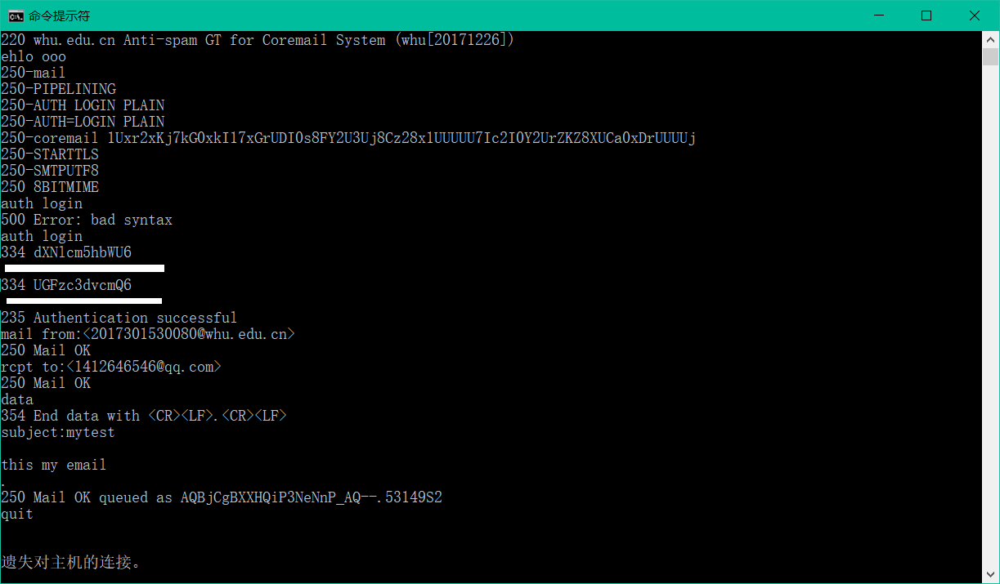
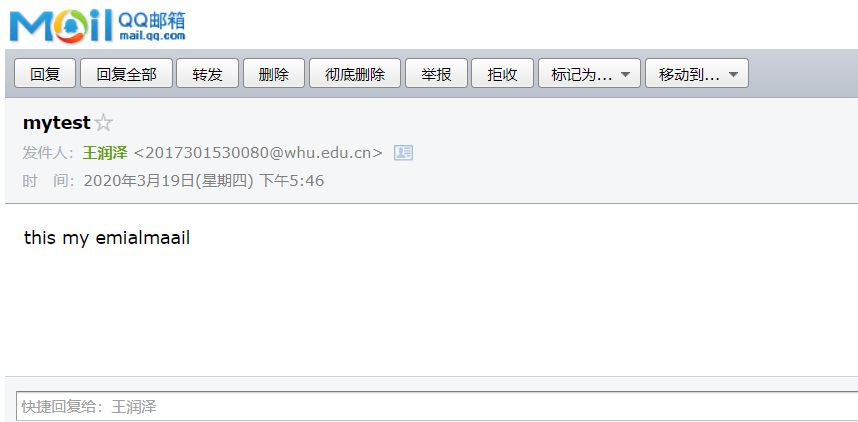
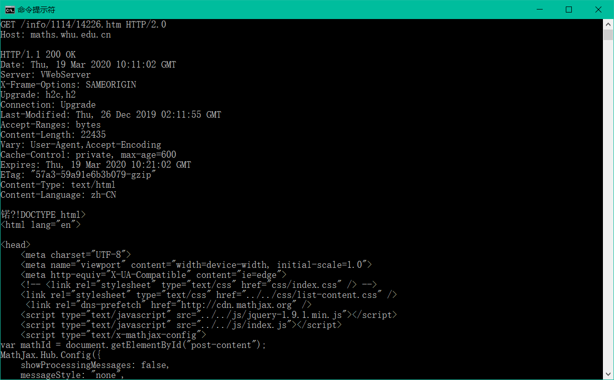
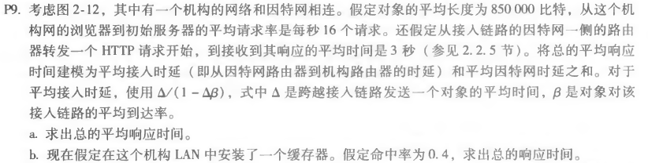
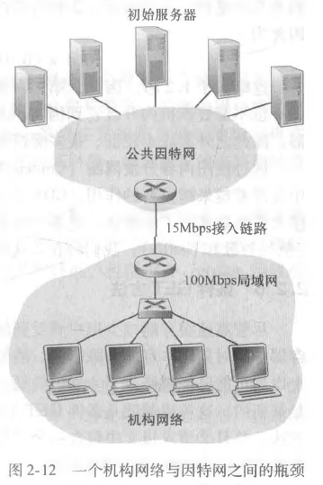
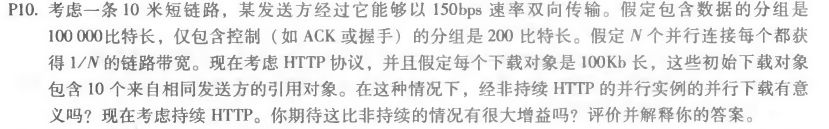

###### author：2017301530080 王润泽

---

### 1.telnet whu.edu.cn 25

首先是用ehlo输入我的用户名 后续用auth login指令后输入我的经过base64加密的账号密码进行登陆。mail from指定发件人，rcpt to选择收件人。data输入邮件内容最后以“.”结尾。quit退出。

---

### 2.telnet maths.whu.edu.cn 80

选择网址 http://maths.whu.edu.cn/info/1114/14226.htm 进行操作

命令行输入 `telnet maths.whu.edu.cn `

按下ctrl+] 再回车

---

### 3.第二章习题

#### 3.1 P9

a.  Δ =850000bit/15Mbps=0.0567s

​	平均接入时延=Δ/(1-Δβ)=0.0567/(1-0.0567*16)=0.61s

​	总的平均响应时间=平均接入时延+接收响应的平均时间=0.61s+3s=3.61s

b.平均接入时延=Δ/(1-Δβ\*0.6)=0.0567/(1-0.0567\*16*0.6)=0.124s

​	命中缓存器时，命中时间=850000bit/1000Mbps=0.0085s

​	总的平均响应时间=0.4\*0.0085s+0.6\*(平均接入时延+接收响应的平均时间)

​									=0.4\*0.0085s+0.6*（0.124s+3s）=1.8778s

#### 3.2 P10

金包含控制的分组的传输时间t1=200bit/150bps=1.33s

引用对象分组的传输时间t2=100Kb/150bps=666.67s

非持续HTTP：t3=t1\*3+t2+(t1\*3+t2)\*10

​							=1.33s\*3+666.67s+(1.33s\*3+666.67s)=7377.26s

持续HTTP:t4=t1\*3+t2+(t1\*3+t2)\*10

​							=1.33s\*3+666.67s+(1.33s+666.67s)=7350.66s

相比之下，持续的HTTP相比于非持续的HTTP有将近0.36%的提升，这个提升可以说是很微小的，但是如果控制分组较大而下载对象的数据比较小的话，提升会比较大。