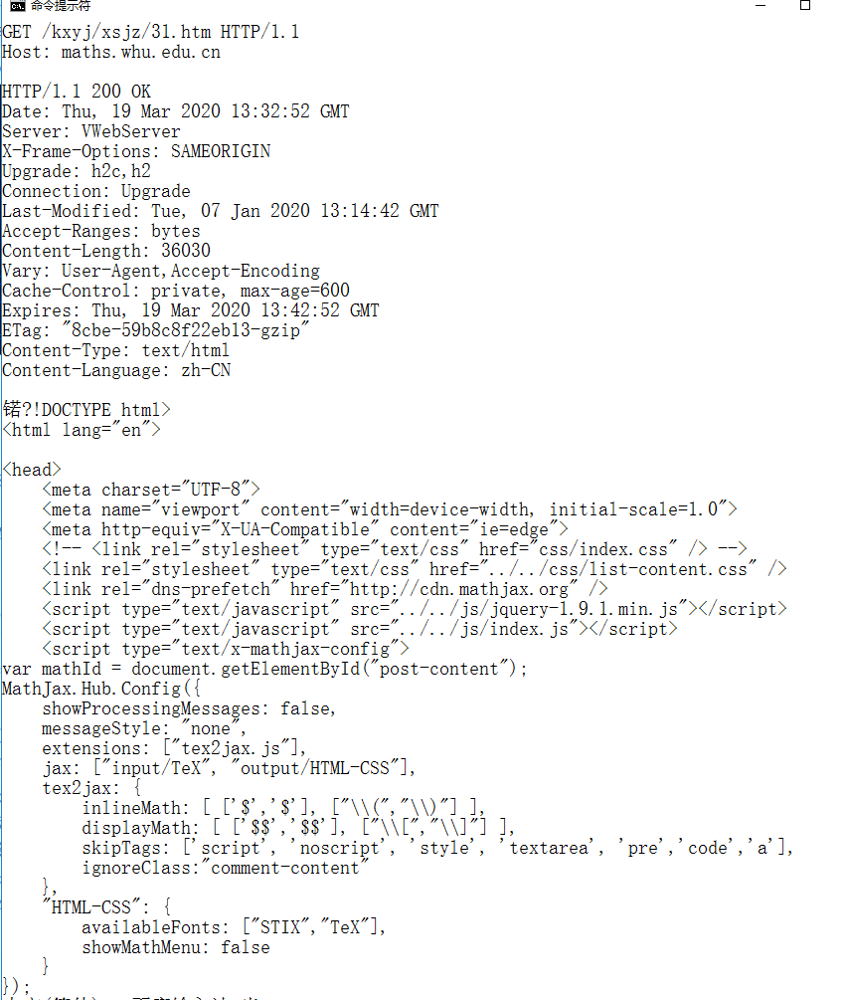
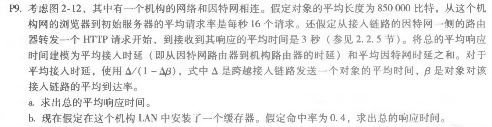
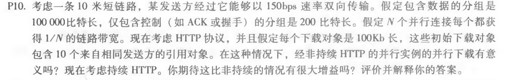

# 网络及分布式计算作业3

## 1.telnet whu.edu.cn 25


```
EHLO hello
auth login
base64加密帐号
base64加密密码
MAIL FROM: <2017301610194@whu.edu.cn>
RCPT TO: <1529105880@qq.com>
```
 


收到邮件截图


## 2.telnet maths.whu.edu.cn 80

```
ctrl+]
enter

GET /kxyj/xsjz/31.htm HTTP/1.1
Host: maths.whu.edu.cn
enter
enter
```



## 习题


p9





a:

Δ = 850000b / 15Mbps = 0.0567s

β = 16请求/s

t接 = Δ/1-Δβ = 0.61s

t总 = t接 + t因 = 3.61s


b:


β’ = 16请求/s * 60%

t接’ = Δ/1-Δβ = 0.12s

当命中缓存器时: t命 = 850000b / 100Mbps = 0.0085s

因此 t总’ = 0.4 * 0.0085 + 0.6(t接’ + t因) = 1.8754s


p10




10米短链路，忽略其传播时延。

带有并行连接的非持续连接且并行下载：

(200b / 150bps) * 3 + ((10^5)b/ 150bps) + (200b / (150bps / 10)) * 3 + ((10^5)b / (150bps / 10)) = 7377.3s

持续连接：

(200b / 150bps) * 3 + ((10^5)b / 150bps) + 10 * (200b/150bps + (10^5)b/150bps) = 7351s


## 作者

软五 2017301610194 马如云


