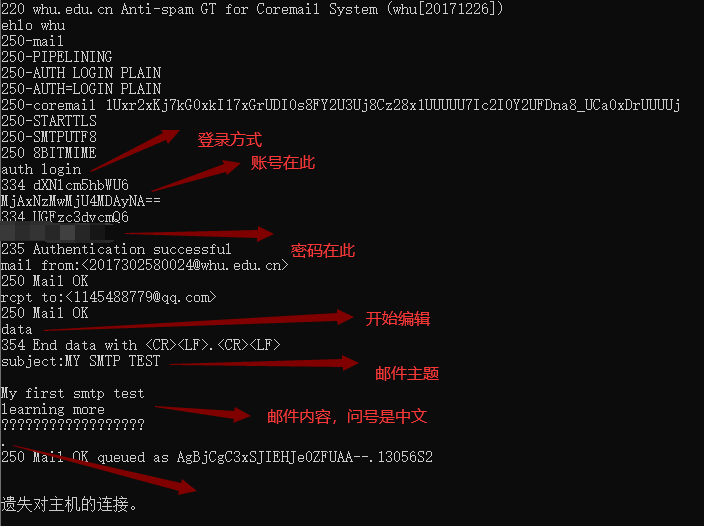
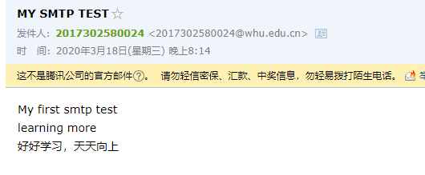
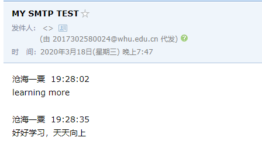
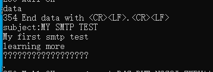
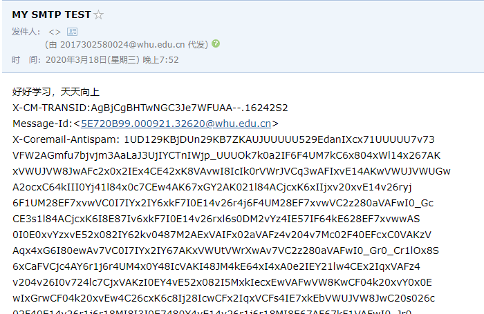
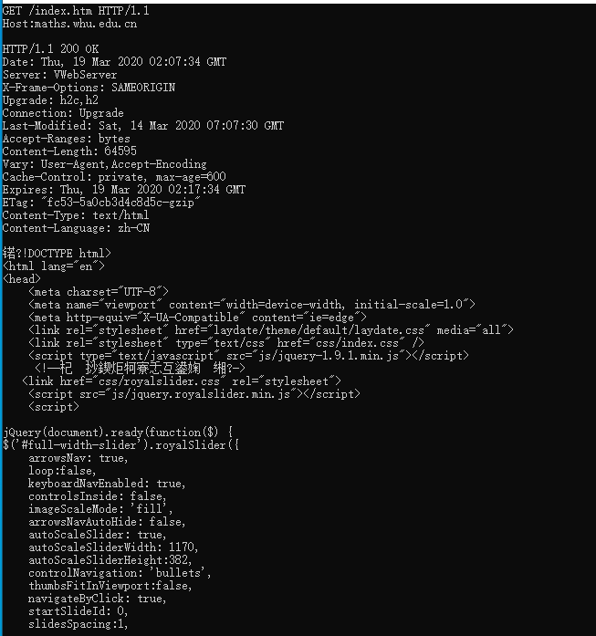
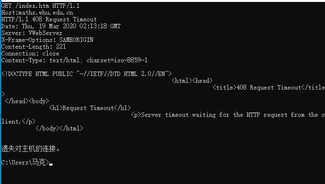

# 作业三

​							*马克*

#### 1，用telnet  whu.edu.cn 25命令测试SMTP通信

###### 详细操作步骤如下：

​	1.打开命令行输入telnet  whu.edu.cn 25。

​	2.待出现220 whu. edu. cn Anti-spam GT for Coremail System (whu[20171226])字样后，输入ehlo  whu命令建立会话，上网查询也可以使用helo命令。（区别是HELO是普通SMTP，不带身份验证也可以继续MAIL FROM下去，直到成功发送邮件，也就是可以伪造邮件。EHLO是ESMTP，带有身份验证，所以没法伪造）。

​	3.通过auth login命令继续进行身份验证。

​	4.分别输入账号，密码（注意一定要用base64加密，不然可能出错）。

​	5.分别输入mail from:<xxx@whu.edu.cn>，rcpt to:<xxx@qq.com>（即发信方，接收方）。

​	6.data命令开始编辑，subject:xxx输入邮件主题（xxx是自定义内容）。

​	7.开始编辑邮件内容，加" . "(点)，结束编辑，回车键邮件即发送。

###### 操作成功的截图：

  

###### 注意事项以及错误示例：

- 账号和密码都要用base64加密

- 输入完subject:xxx之后需要按一次换行键，不然可能会出现邮件第一行遗失，邮件发件人遗失的情况或者出现乱码，截图如下：

  #情况一（有遗失情况）

  

  

  #情况二

  

  

###### 群策群力

​	上面出现的步骤如果有误，或者错误原因您清楚，抑或是您有什么别的想法，希望您能给我留言。感谢指正。

#### 2，telnet maths.whu.edu.cn 80

###### 详细操作步骤如下：

​	1.打开命令行，输入telnet maths.whu.edu.cn 80连接该网址的80端口。

​	2.按ctrl+] 回显（显示你输入的内容）

​	3.按enter键进入编辑模式

​	4.输入GET /index.htm HTTP/1.1和Host:maths.whu.edu.cn获取主页信息

​	5.连按两下enter键得到返回的网页内容。

###### 成功截图：

###### 注意事项及错误示例：

- 关于操作步骤的第五步，输入完get命令后一定要输入两次enter键，只输入一次的话会出现如下的错误(显示超时408)：

###### 群策群力

​	上面出现的步骤如果有误，或者错误原因您清楚，抑或是您有什么别的想法，希望您能给我留言。感谢指正。

#### 第二章习题选做：

###### P8.

a.没有并行tcp连接的非持续http
$$
2RTT_0+RTT_1+RTT_2+...+RTT_n+8*2RTT_0=18RTT_0+RTT_1+RTT_2+...+RTT_n
$$
b.配置5个并行连接的非持续http
$$
2RTT_0+RTT_1+RTT_2+...+RTT_n+2*2RTT_0=6RTT_0+RTT_1+...+RTT_n
$$
c.持续http连接
$$
2RTT_0+RTT_1+RTT_2+...+RTT_n+RTT_0=3RTT_0+RTT_1+...+RTT_n
$$

###### p9.

a.
$$
\Delta=850000b/15Mbps=0.0567s
$$

$$
\beta=16请求/s
$$

$$
t_{接}=\Delta/1-\Delta\beta=0.61s
$$

$$
t_{总}=t_{接}+t_{因}=3.61s
$$

b.
$$
\beta_1=16请求/s*0.6=9.6请求/s
$$

$$
t_{接1}=\Delta/1-\Delta\beta=0.12s
$$

$$
t_{命中}=850000b/100Mbps=0.0085s
$$

$$
t_{总}=0.4*0.0085+0.6*（t_{接}+t_{因}）=1.8754s
$$

