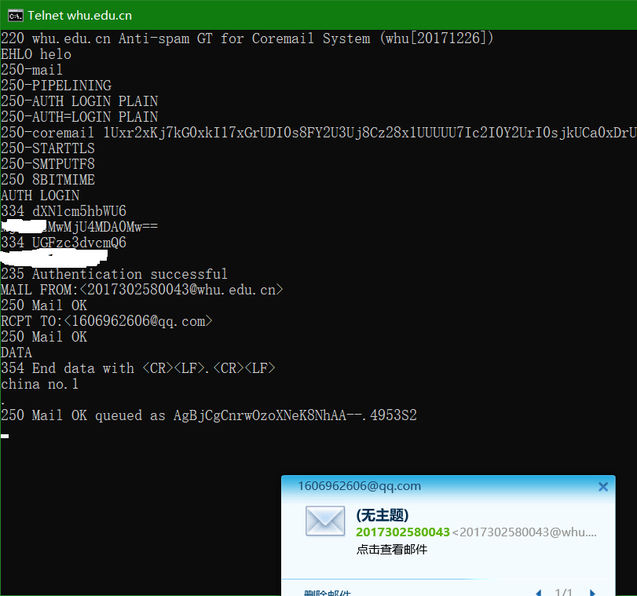
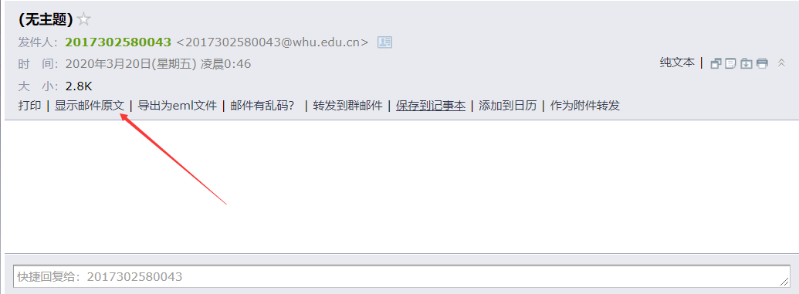
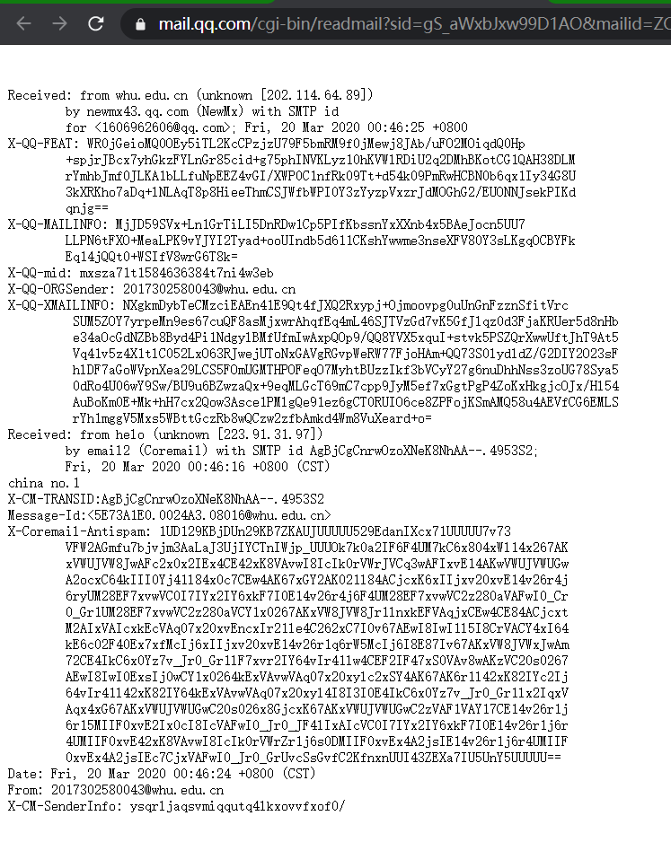
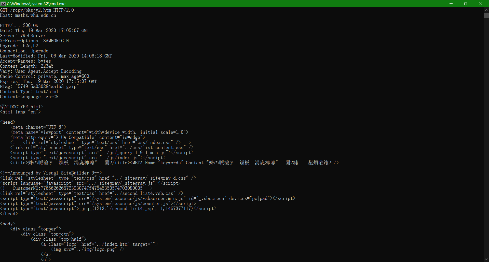
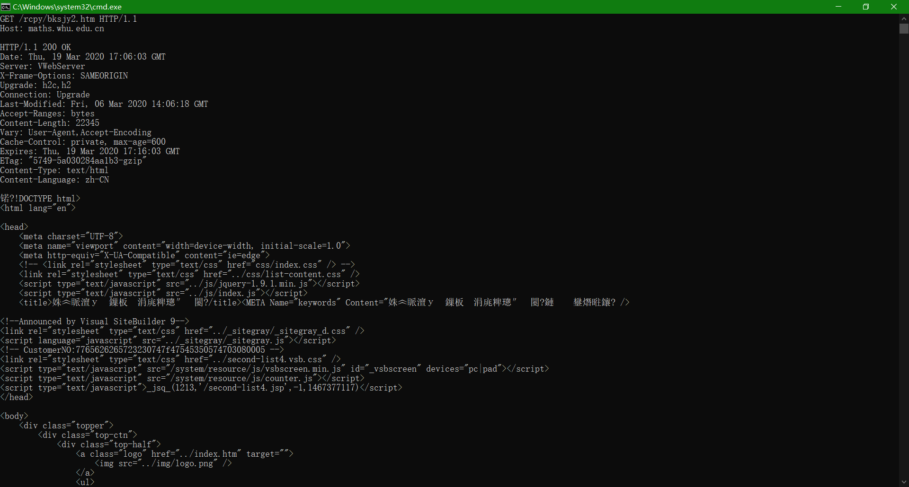

### 1.whu.edu.cn的smtp交互

* telnet whu.edu.cn 25 并且发一个邮件

  

* 发送结果不知道为啥不对劲儿啊

> 
>
> 

### 2.math.whu.edu.cn的GET
* GET /index.htm HTTP/2.0 请求结果2.0
  

* GET /kxyj/xsjz/31.htm HTTP/1.1 请求结果1.1
  

### 3.习题
* p5

a. 能够成功找到。回答时间：Tue, 07 Mar 2008 12:39:45 GMt

b. 修改时间：Sat, 10 Dec2005 18:27:46 GMT

c. Content-Length：3874。

d. 返回文件的前五个字节是: <!doc；Connection：keep-alive——持续链接。

* P7

得到IP地址的时间 = RTT1 + RTT2 + … + RTTn
三次握手加上最后的响应 = 2 RTT0
因此总共是 2 *RTT0* + *RTT1* + *RTT2* + … + *RTTn*

* p10

T1 = *3(200b/150bps) + 100000b/150bps + 3(200b/(150bps/10)) + 100000b/(150bps/10)* = **7377.3 s**

T2 = *3(200b/150bps) + 100000b/150bps + 10(200b/150bps + 100000b/150bps)* = **7350.7 s**

不明显