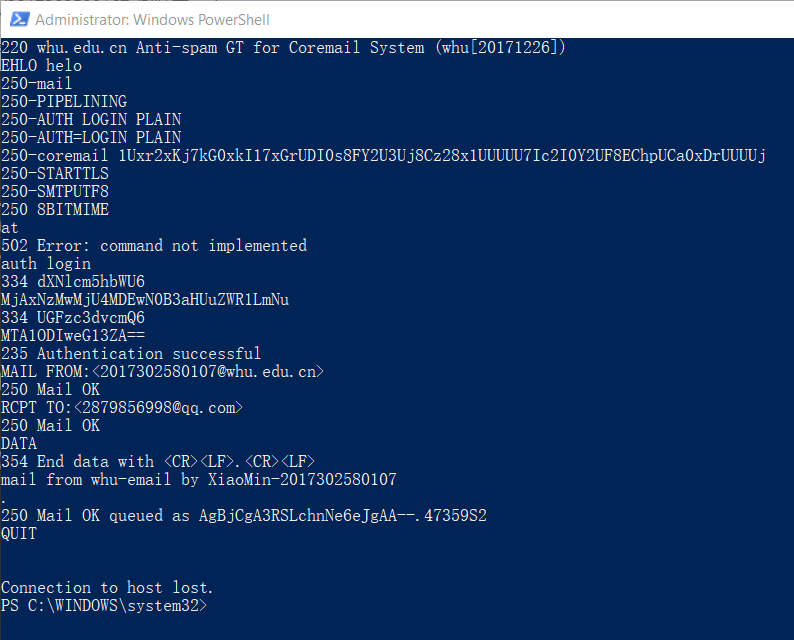
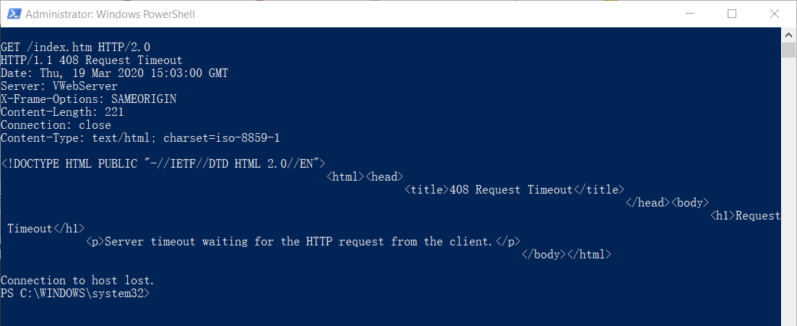
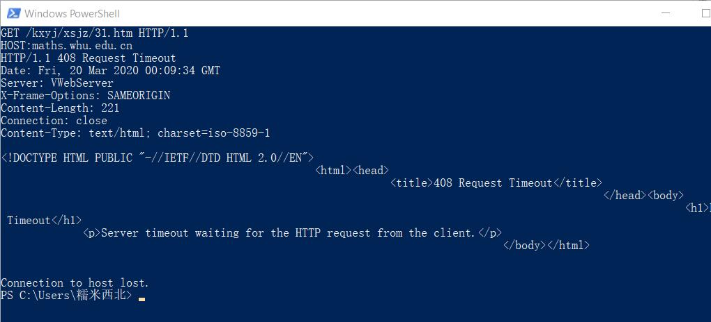
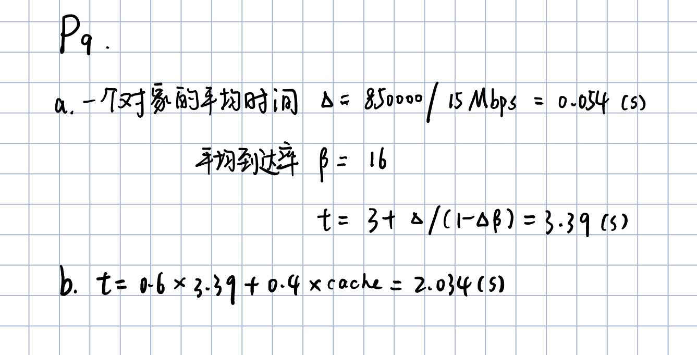

### **1.与武大官网在端口25进行smtp交互**
-  **telnet whu.edu.cn 25**

> -telnet whu.edu.cn 25
>
> -220 whu.edu.cn Anti-spam GT for Coremail System (whu[20171226])

-  **输入smtp交互命令**
> -EHLO helo
>
> -auth login
>
> -base64编码的邮箱地址
>
> -base64编码的邮箱密码
>
> -MAIL FROM:<2017302580107@whu.edu.cn>
>
> -RCPT TO:<2879856998@qq.com>
>
> -DATA(开始输入邮件内容)
>
> -. (结束邮件内容)
>
> -QUIT(退出程序)

- **发送邮件结果**

### **2.向数学学院官网发送GET请求**
- telnet maths.whu.edu.cn 80
> -telnet maths.whu.edu.cn 80
>
> -1. ctrl+]
>
> -2. enter
>
> -3. 粘贴:GET /kxyj/xsjz/31.htm HTTP/1.1  
>Host:maths.whu.edu.cn
> -4. enter, enter
- **GET /index.htm HTTP/2.0 请求结果1**

- **GET /kxyj/xsjz/31.htm HTTP/1.1 请求结果2**

### **3.第二章课后习题**
- **P4**
>a. http://gaia.cs.umas.edu/cs453/index.html
>
>b. 1.1版本
>
>c. Connection:keep-alive表明这是一个持续连接
>
>d. 这里无法看出主机的IP地址
>
>e. Mozilla/5.0。服务器需要将对象的不同版本发到对应的浏览器

- **P7**
> 