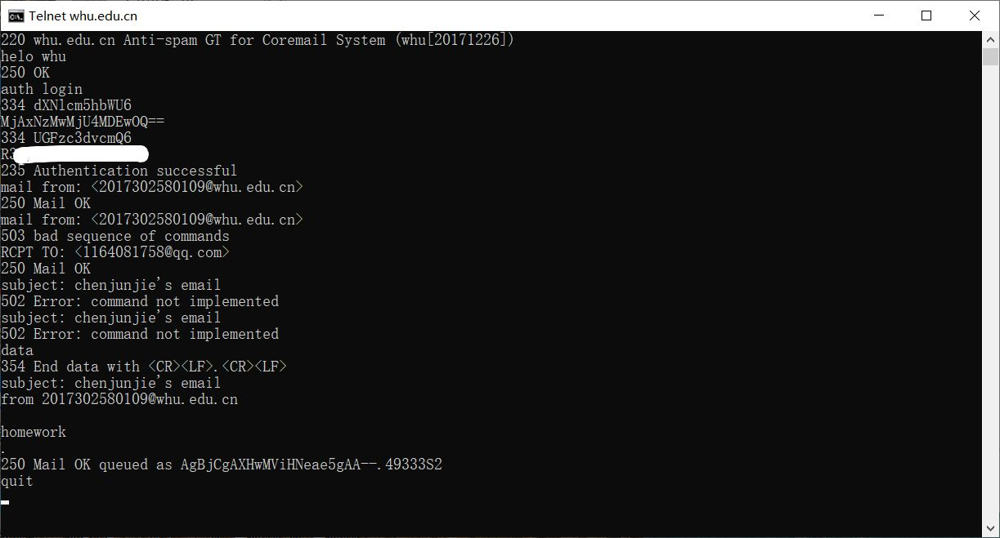
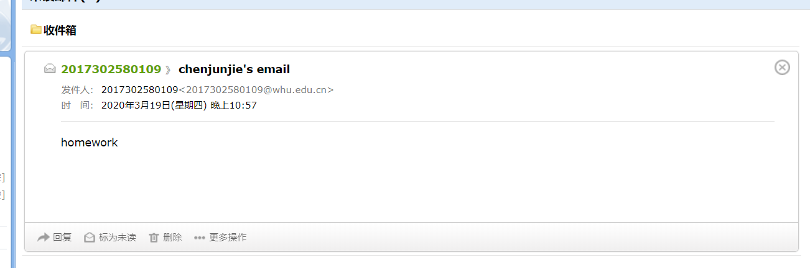
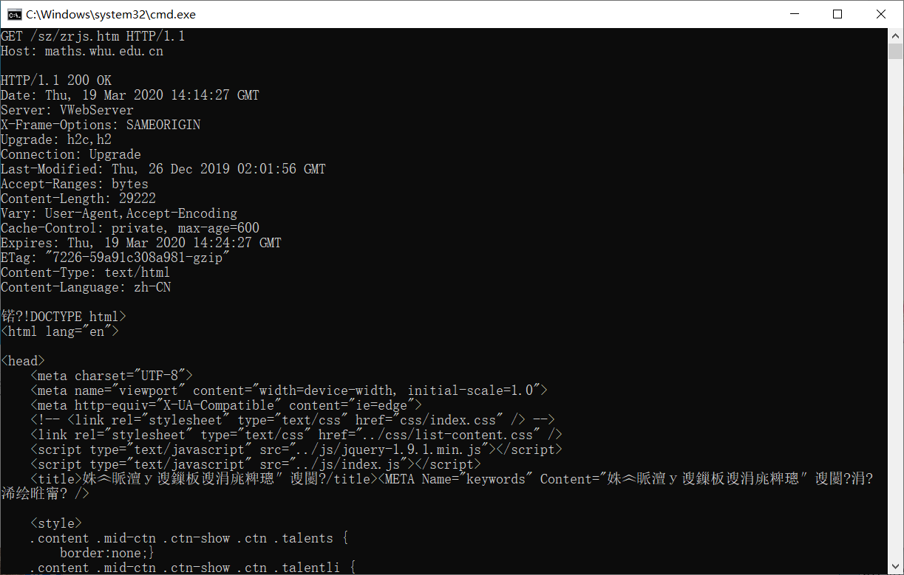
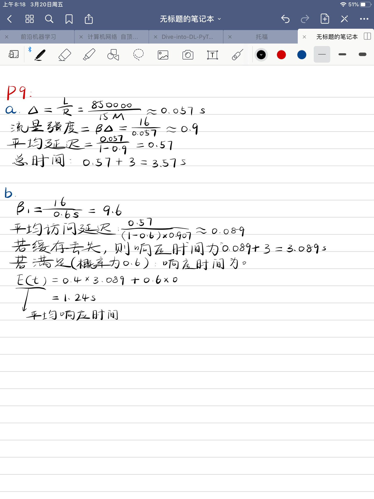

# Homework3

+ telnet whu.edu.cn 25

  操作步骤：

  1. telnet whu.edu.cn 25
  2. ctrl + ]
  3. Enter
  4. helo whu
  5. auth login
  6. 输入转为base64格式的邮箱账号和密码
  7. mail from 指明发送邮件的邮箱
  8. rcpt to指定目标邮箱
  9. data 编辑邮件内容
  10. quit退出
  
  
  
  接收到邮件的截图：
  
  
  
+ telnet maths.whu.edu.cn 80

  操作步骤：

  1. 先去maths.whu.edu.cn官网，找到一个html页面，复制网址（即该html文件在目标服务器上的位置）
  2. telnet whu.edu.cn
  3. GET 刚才找到的网址
  4. Enter
  5. Host: maths.whu.edu.cn
  6. Enter
  7. 得到了返回的html页面的代码

  

+ 选择习题P7、P9

  + P7：

    获取IP地址的总时间为$RTT_1+RTT_2+...+RTT_n$

    总响应时间为$2*RTT_O+RTT_1+RTT_2+...+RTT_n$

  + 

  + P9:

    