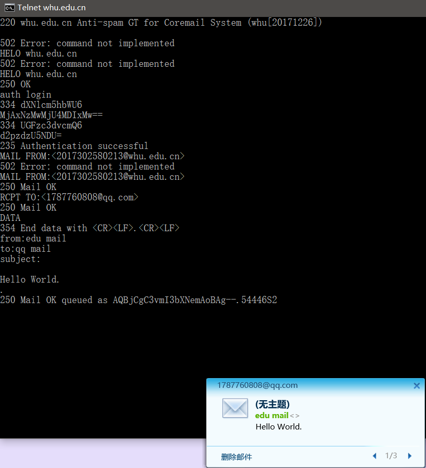
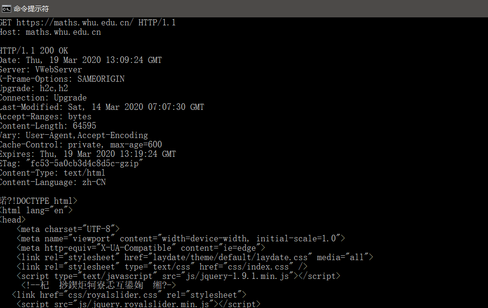

# 作业三

### 2017302580213 彭英杰 软工五班

--------------------------------------------------

> ## P1
>
> a. False。客户将发送4个请求报文并接收4个响应报文
>
> b. True。位于同一台服务器的多个web页面在从该服务器发送给同一个客户时，可以在单个持续TCP连接上进行
>
> c. False。采用非持续连接的HTTP时，一个TCP连接上只能发送一次HTTP服务请求报文
>
> d. False。Date：首部行指示服务器产生并发送该响应报文的日期和时间。值得
> 一提的是，这个时间不是指对象创建或者最后修改的时间，而是服务器从它的文件系统中
> 检索到该对象，将该对象插入响应报文，并发送该响应报文的时间。Last-Modified:首部行指示了对象创建或者最后修改的日期和时间
>
> e. False。可以有空的报文体。当服务器收到一个使用HEAD方法的请求时，将会用一
> 个HTTP报文进行响应，但是并不返回请求对象。
>
------------------

> ## P4
>
> a. gaia.cs.umass.edu/cs445/index.html
>
> b. HTTP / 1.1
>
> c. 持续连接，keep-alive ：300
>
> d. HTTP 报文中没有该浏览器所运行的主机的IP 地址。
>
> e. Mozilla / 5.0。服务器需要浏览器类型信息将发送给不同类型的浏览器相同对象的不同版本

----------

> ## TELNET
>
> ​		Telnet协议是TCP/IP协议族中的一员，是Internet远程登录服务的标准协议和主要方式。它为用户提供了在本地计算机上完成远程主机工作的能力。在终端使用者的电脑上使用telnet程序，用它连接到服务器。终端使用者可以在telnet程序中输入命令，这些命令会在服务器上运行，就像直接在服务器的控制台上输入一样。可以在本地就能控制服务器。要开始一个telnet会话，必须输入用户名和密码来登录服务器。Telnet是常用的远程控制Web服务器的方法。
>
> ##  **telnet  whu.edu.cn  25**
>
> 1. 在命令行下输入telnet whu.edu.cn 25，回车。远程登陆到smtp服务器
>
> 2. 继续输入HELO whu.edu.cn，回车。该命令向服务器表明用户身份。回显 250 OK，说明服务器认可了你的身份
>
> 3. 继续输入auth login，回车。告诉服务器要输入用户名了（即登录邮箱时的用户名），服务器将返回一个确认信息334
>
> 4. 输入用户名**（注意这里的用户名需要base64编码后才能识别）**，回车。服务器将返回一个确认信息334
>
> 5. 输入密码**（同base64编码）**，回车。如果用户名、密码正确，服务器将返回成功的信息
>
> 6. 输入 mail from：< > 回车  <>中填写发件人的邮箱，即你自己的邮箱名
>
> 7. 输入 rcpt to：< >   回车  <>中填入收件人的邮箱
>
> 8. 输入 data 回车 ，回车后就可以开始写邮件内容了
>
> 9.  输入 from：发件人名称 ，此项可任意填入，将显示在收件箱的‘发件人’一栏
>
> 10. 输入 subject：信件主题  ，显示在收件箱的‘主题’一栏中
>
> 11. 此时需空一行，即在一空行直接回车，表示正文部分的开始
>
> 12. 空行后输入信件的正文内容。
>
> 13. 在正文输入结束时输入一个 . （英文输入法下的句号）
>
>     
>
> ##  **telnet  maths.whu.edu.cn  80**
>
> 1. 在命令行下输入telnet  maths.whu.edu.cn 80，回车。远程连接网站
>
> 2. 输入CTRL+]后，再输入回车换行。
>
> 3. 继续输入GET https://maths.whu.edu.cn/ HTTP/1.1，回车后继续输入Host: maths.whu.edu.cn，连续回车两次，返回服务器返回的HTTP响应报文。
>
>    

--------------

