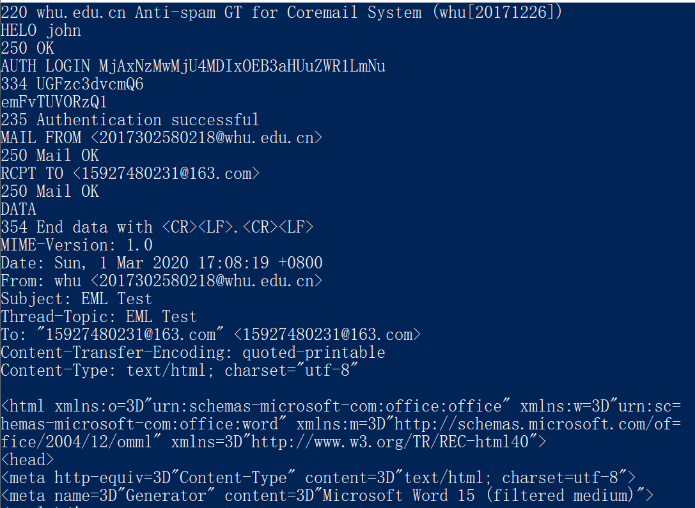
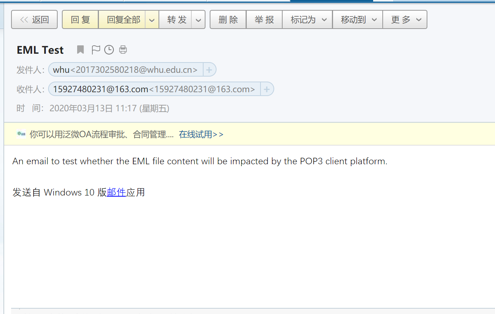
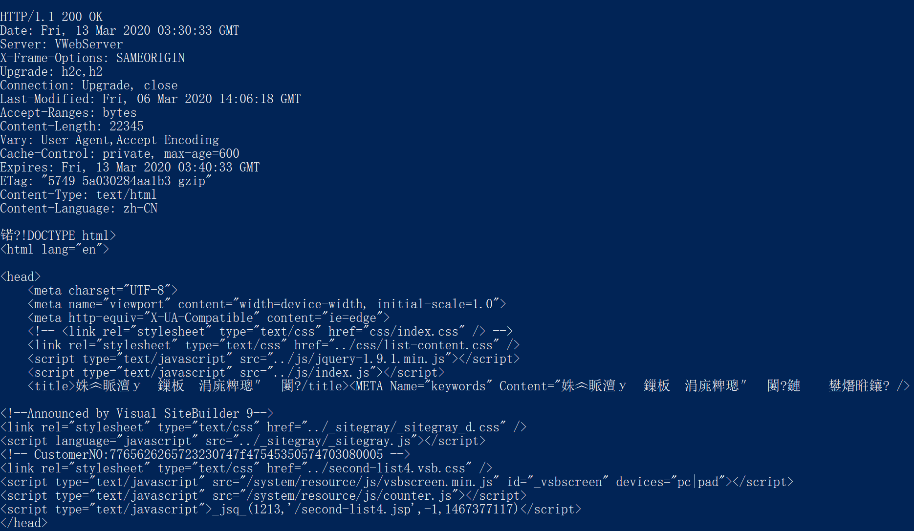
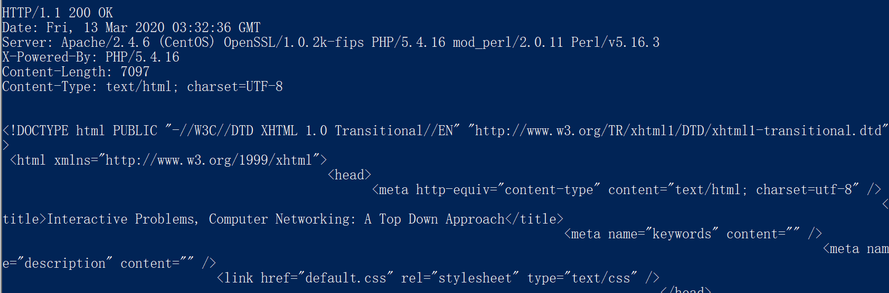

## HomeWork 3

### 一、telnet whu.edu.cn 25

- 在WindowsShell中输入 ```telnet whu.edu.cn 25```就可以通过25端口与该服务器进行TCP连接，因为SMTP协议默认端口为25。然后按照标准发送邮件的流程：向服务器打招呼，进行身份验证（用户名 + 密码/授权码），写邮件的具体内容并发送，退出连接。

- 这里用自己的武大邮箱向另一个163邮箱发了一个简短的邮件，邮件内容从其他地方复制过来，是HTML格式的。需要注意的是这里的用户名和密码得经过**Base64编码**才能输入，明文输入会返回不正确的状态码。



- 登陆上163邮箱能看到刚刚发送的邮件内容如下：



### 二、telnet whu.edu.cn 80

- 类似的，输入 ```telnet whu.edu.cn 80```就可以通过80端口与该服务器进行TCP连接（HTTP协议默认端口为80），然后进入一个新界面输入下面两行（在屏幕上不会显示输入，所以防止输错就先写好然后复制过去）

```
GET /rcpy/bksjy2.htm HTTP/1.0
Host: maths.whu.edu.cn
```

- 服务器响应结果：(由于编码的原因这里对于中文会显示乱码)



- 这里也试了下gaia.cs.umass.edu网站的响应，用的HTTP协议的版本是2.0，与前面的1.0不同。（内容为全英，不会有乱码现象）

  ```GET /kurose_ross/interactive/index.php HTTP/2.0```
  ```Host: gaia.cs.umass.edu```

  


###三. 课后习题

### P10

> 考虑一条10米短链路，某发送方经过它能够以150bps速率双向传输。假定包含数据的分组是 100 000比特长，仅包含控制（如ACK或握手）的分组是200比特长。假定N个并行连接每个都获 得$1/N$的链路带宽。现在考虑HTTP协议，并且假定每个下载对象是100Kb长，这些初始下载对象 包含10个来自相同发送方的引用对象。在这种情况下，经非持续HTTP的并行实例的并行下载有意义吗？现在考虑持续HTTP。你期待这比非持续的情况有很大增益吗？评价并解释你的答案。

答：由于这里的链路很短，所以不考虑其传播时延。

- 对于非持续HTTP并行下载的情况，首先得经过发起TCP连接请求、服务器响应TCP然后再给服务器发送HTTP请求三个阶段，这里每次只发送含控制的分组。这样会收到服务器传来的含数据的分组，这里一个含数据的分组可以包含在一个下载对象里。接着解析这个初始对象找出10个引用对象，通过并行连接(所以这里有 N = 10)同时发送10个TCP请求，得到回复后才并行发送10个HTTP请求，最后得到所有的引用对象。消耗的总时延为：$t_{1} = \frac{200b}{150bps} * 3 + \frac{100000b}{150bps} + \frac{200b}{150bps/10} * 3 + \frac{100000b}{150bps/10} = 7377.3s$

- 对于持续HTTP来说，第一次建立过TCP连接后，之后的引用对象请求时不用重新进行TCP的请求和响应，只进行HTTP请求，时延为$t_{2} = \frac{200b}{150bps} * 3 + \frac{100000b}{150bps} + (\frac{200b}{150bps} + \frac{100000b}{150bps}) * 10 = 7352.6s$
- 比较两者发现，持续HTTP的时延相对来说较小，但差距也很小。这是因为虽然持续HTTP减少了TCP连接的次数，也就减少了发送含控制的分组的时间，但这部分时间在整个时延所占的比重较小，对于总体传输时延影响不大。

###P11

答：

- a) 能；因为Bob使用并行连接时能增加单位时间的连接数，而与此同时其他四个用户的连接数无法增加，这样一来Bob对于链路带宽的占用率就比其他四个用户大，自然能更快得到数据。
- b) 是的；因为在这种情况下，五个用户均分了链路带宽，如果Bob不用并行连接，就会比其他用户慢。

### P15

答：MTA全称为 Mail Transfer Agent，代表邮件传输代理。主机将消息发送给MTA。然后，该消息遵循一系列MTA以到达接收者的邮件阅读器。MTA应该报告它收到消息的位置，邮件每经过一个 MTA，该MTA就会在邮件头部的顶部添加类似“邮戳”一样的信息，显示邮件所经过的MTA的信息。

这里的恶意主机应该是最开始的Received行指出的主机，它只是标明了邮件由哪里来，却没标明接收者的位置。


