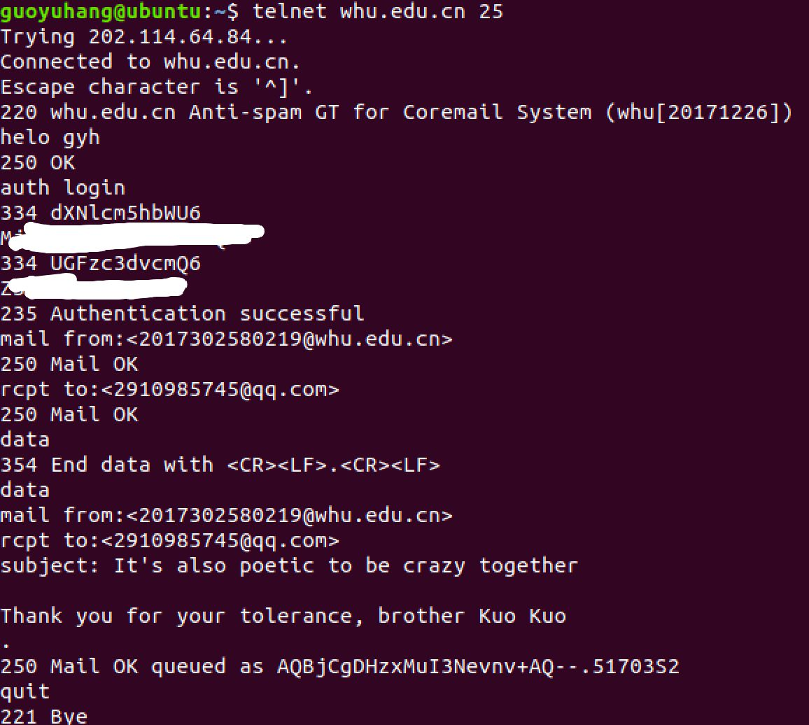
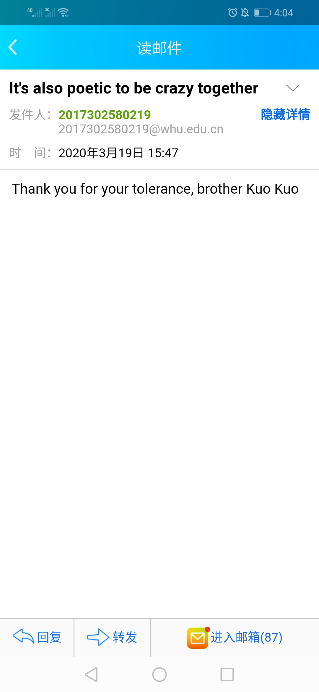
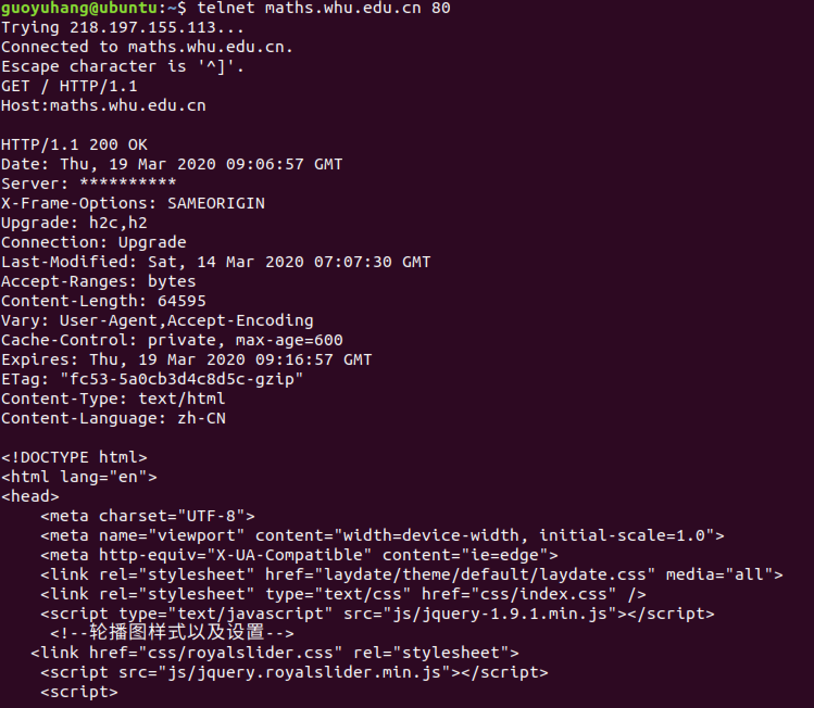
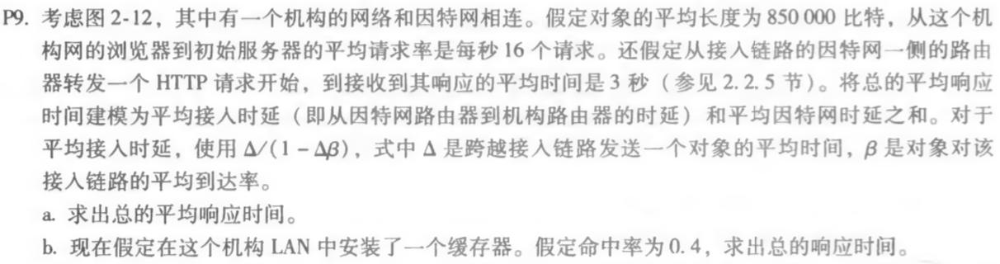

### 1.telnet-1: telnet whu.edu.cn 25

##### 学习网站：[https://www.cnblogs.com/ysocean/p/7653252.html](https://www.cnblogs.com/ysocean/p/7653252.html)

说明：采用Linux系统进行telnet

- 连接服务器 telnet whu.edu.cn 25

- ==登录用户== helo gyh

- ==确认登陆认证方式==auth login

- ==经过Base64加密的用户名和密码==

- mail from:<2017302580219@whu.edu.cn>

- rcpt to:<2910985745@qq.com>

- `data`

  mail from:<2017302580219@whu.edu.cn>

  rcpt to:<2910985745@qq.com>

  subject: It's also poetic to be crazy together

  这里空一行，下面写邮件具体内容

  Thank you for your tolerance,I love you. brother Kuo Kuo

- 输入 `.` 邮件输入完成
- 输入 `quit` 断开与服务器的连接

##### 操作截图：

看邮件接受结果：

#### 2. telnet-2: telnet maths.whu.edu.cn 80

- `telnet maths.whu.edu.cn 80`

- `GET / HTTP/1.1`

- `Host:maths.whu.edu.cn`

  

  ##### 过程及结果如下：

  

  

#### 2.书上练习题：

##### p3题目：

##### 答：

> a.错，因为在对于一个web页面中，每一个对象都需要发出一个请求消息，然后收到相应的响应报文，因此请求一个web页面时，所有对象的请求消息和响应报文成对出现。应为四个请求消息和四个响应消息。
>
> b.对，当两个web页面都是来自同一个域名时，即要对这两个web页面发出请求时，是对同一台服务器发出连接请求，所以在一个持久连接中，因为已经客户端浏览器已经服务器建立了TCP连接，在此基础上就可以连续传递多个对象，当所有对象的请求和来自服务器的应答都收到后，TCP连接才关闭，故这两个不同的网页可以在同一个持久连接中传送。 
>
> c.错，在非持久连接中，对于要传送的每一个web对象都要建立相应的TCP连接，在对应于每一个对象的TCP连接建立完成后，客户端就向服务器发送请求消息，然后在服务器收到请求消息之后就会发回一个包含客户端请求的对象的应答消息然后就关闭TCP连接，因此在一个TCP连接中不可能有两个不同的HTTP请求消息。
>
> d.错，是提供日期和时间标志,说明报文是什么时间创建的。
>
> e.错，HTTP响应报文可以有空的报文体。
>

#### p9 题目：

##### 答：

> a. Δ = 850000b / 15Mbps = 0.0567s
>
> t~接入~ =Δ/1-Δβ = 0.61s
>
> t~总~=t~接入~+t~因特网~=3.61s
>
> 
>
> b.β'=16*(1-0.4)=9.6个请求/秒
>
> t~接入~'=Δ/1-Δβ=0.12s
>
> t~命中~= 850000b / 100Mbps = 0.0085s
>
> t~总~'=t~命中~+t~服务~=0.4*0.0085s+0.6(t~接入~'+t~因特网~) = 1.8754s
>

