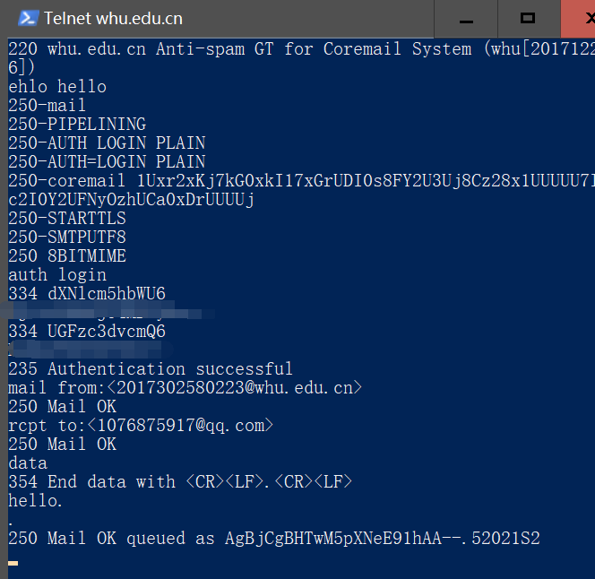
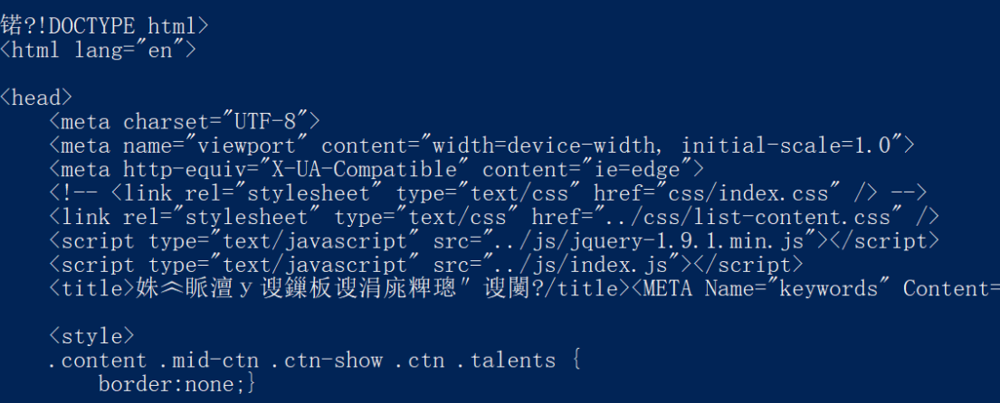
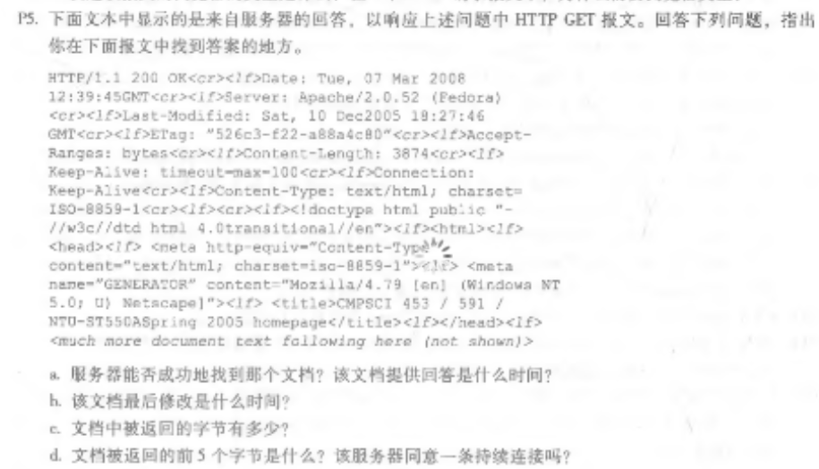
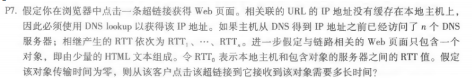

## 1. SMTP

- `telnet whu.edu.cn 25`

~~~
// 输入命令（依次）
ehlo hello
auth login
$username(base64)
$password(base64)
mail from:<$mail_from>
rcpt to:<$mail_to>
data
$message.
~~~

- `telnet maths.whu.edu.cn 80`

~~~
// 输入命令
GET /index.htm HTTP/1.1
Host: maths.whu.edu.cn
// 回车得到html页面
~~~

## 2. 课后习题

- `P5`

~~~
1."200 OK"表示服务器能成功找到文档
根据"Date: "可以看出答复时间是"Tue, 07 Mar 2008 12:39:45 GMT"
2.根据"Last-Modified:"可以得知最后修改时间是
"Sat, 10 Dec 2005 18:27:46 GMT"
3.根据"Content-Length: 3874"可以得知返回数据有3874个字节
4.返回前5个字节是"<!doc"
根据"Connection: Keep-Alive"得知是持久连接
~~~

- `P7`

~~~
得到IP地址需要的时间为：RTT1+RTT2+…+RTTn 
三次握手加上响应时间一共为：2RTT0 
总计：2RTT0+RTT1+RTT2+…+RTTn
~~~

