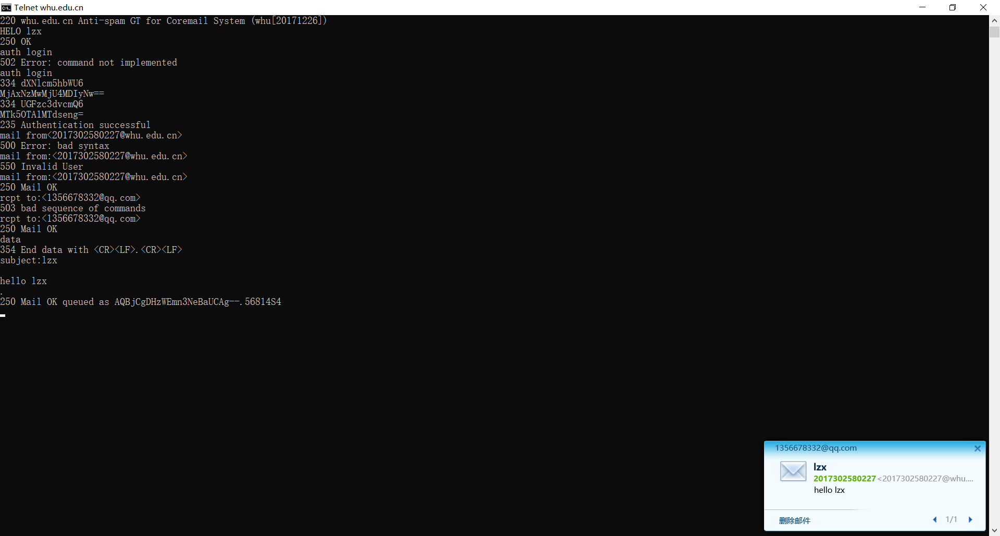
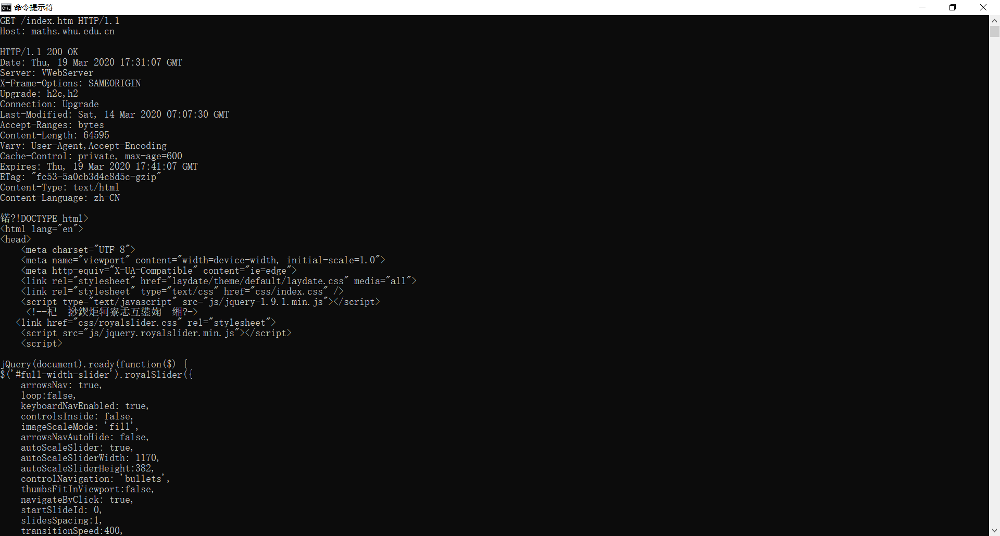
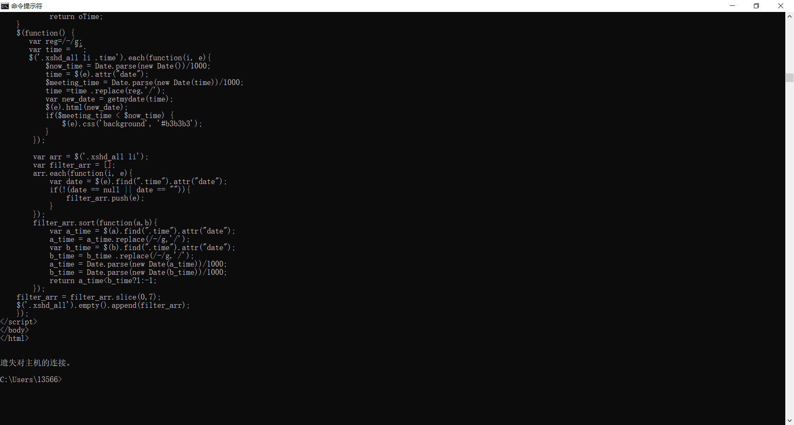

# 网络及分布式计算第三次作业

## Telnet whu.edu.cn 20

## Telnet maths.whu.edu.cn 80

## 课后习题

### P4

a)文档请求是http://gaia.cs.umass.edu/cs453/index.html.host：字段表示服务器的名称，/cs 453/index.html表示文件名。

b)浏览器正在运行HTTP1.1版本，就像第一对之前所指出的那样。

c)浏览器正在请求持久连接，如连接所示：保持-活动。

d)这是刁钻的问题。此信息不包含在任何地方的HTTP消息中。因此，仅看HTTP消息的交换就无法区分这一点。您需要从IP数据报(承载承载HTTPGET请求的TCP段)中获得信息来回答这个问题。

e)Mozilla/5.0。服务器需要浏览器类型信息将同一对象的不同版本发送到不同类型的浏览器。

### P5

a）状态代码200和短语ok表示服务器能够找到文档成功。答复于2008年3月7日星期二提供格林威治标准时间12:39:45。

b）上一次修改index.html文档是在2005年12月10日星期六18:27:46 格林尼治时间。

c）返回的文档中有3874个字节。

d）返回文件的前五个字节是：<！医生服务器同意持久连接，如connection:Keep Alive字段所示