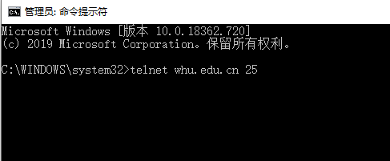
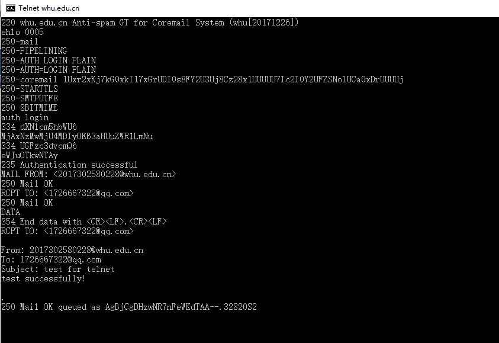
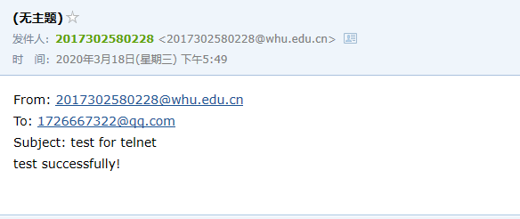
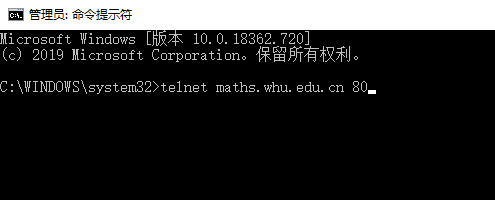
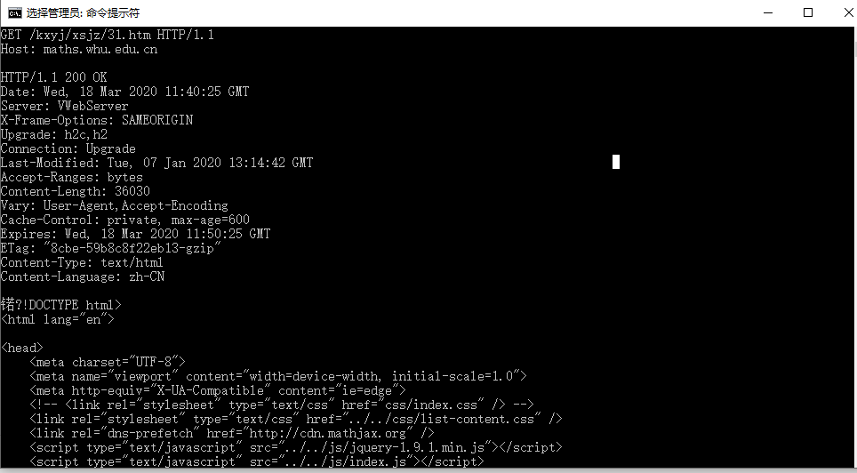

### 1.Telnet whu.edu.cn 25

1. 与武大官网端口25连接

   在命令行输入以下指令：

​             `telnet whu.edu.cn 25`

  2.输入smtp交互命令

   测试成功，受到发送的邮件：

### 2.Telnet maths.whu.edu.cn

   1.与武大数院网站80端口连接

​       在命令行输入以下命令：

​         `telnet maths.whu.edu.cn 80`

   2.输入GET请求

​     输入ctrl+]和回车后，输入以下指令：

​           `GET /kxyj/xsjz/31.htm HTTP/1.1`

​           `Host: maths.whu.edu.cn 80`

### 3.第二章习题

##### p4

​		a.  由浏览器请求的文档的URL是gaia.cs.umass.edu/cs453/index.html

​		b.  HTTP版本是HTTP/1.1

​		c.  报文内容有Keep-Alive: 300，可见这是请求的是一条持续连接。

​		d.  报文中没有运行主机的IP地址。

​		e.  发起该报文的浏览器是Mozilla/5.0，服务器需要浏览器类型信息以将对象的不同版本发给对应的浏览器。

##### p9

​		a.

​			Δ = (850000bits)/(15000000bits/sec) = 0.0567sec

​			平均接入时延：Δ/(1-Δβ) = 0.0567sec/(1-0.0567sec*16req/sec) = 0.6sec

​			总的平均响应时间：3sec + 0.6sec = 3.6 sec

​		b.

​			平均接入时延：Δ/(1-Δβ) = 0.0567sec/(1-(0.60)(0567sec)(16req/sec)) = 0.12sec

​			总的平均响应时间: (0.4)(0 sec) + (0.6)(3 + 0.12sec) = 1.872 sec

​			

​	

​       

