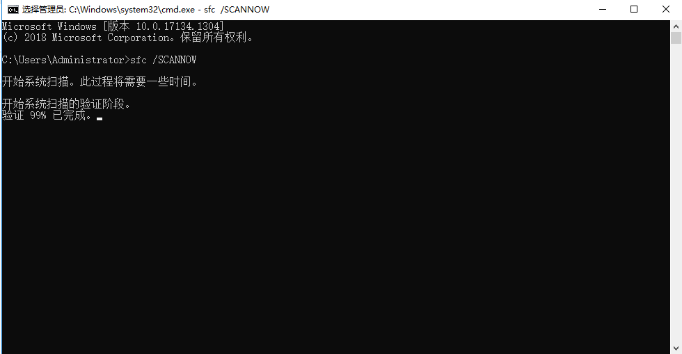
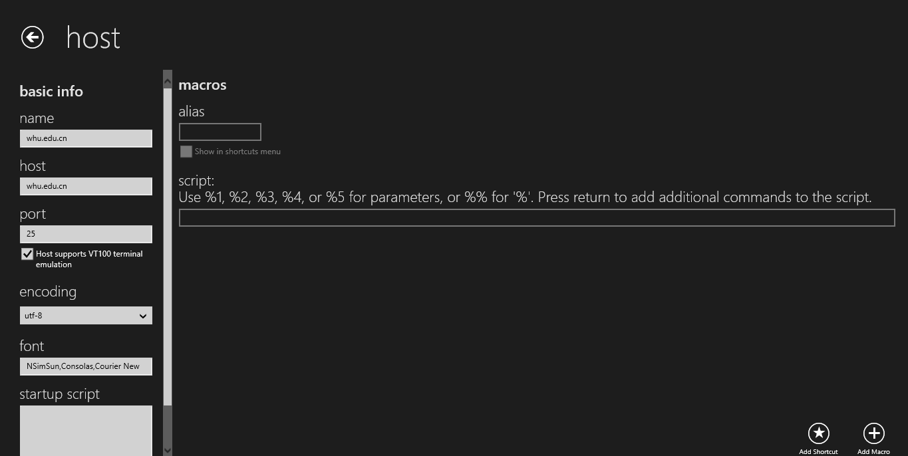
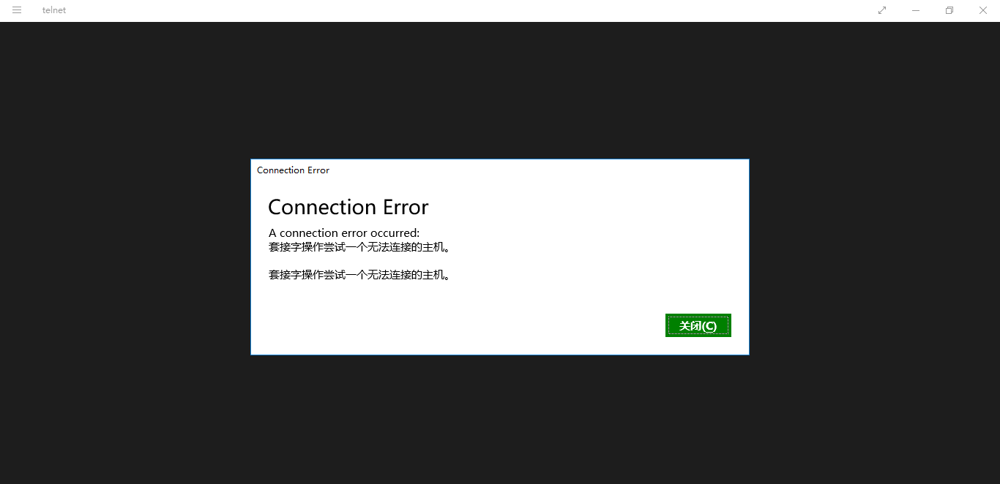
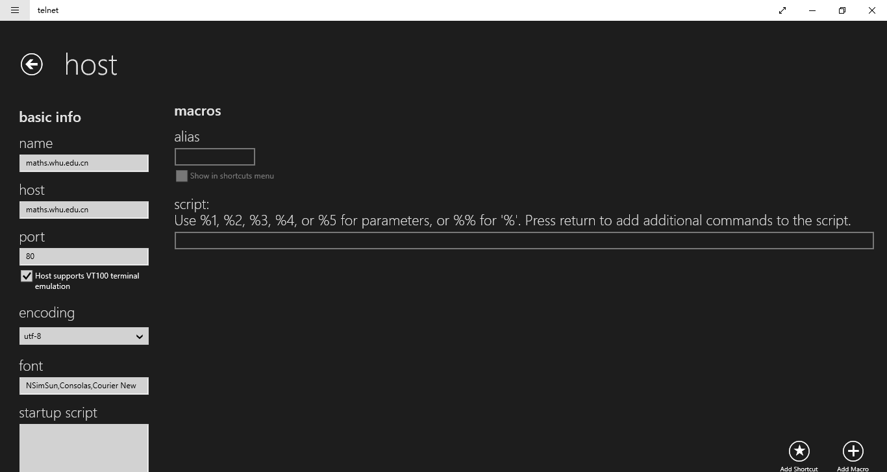
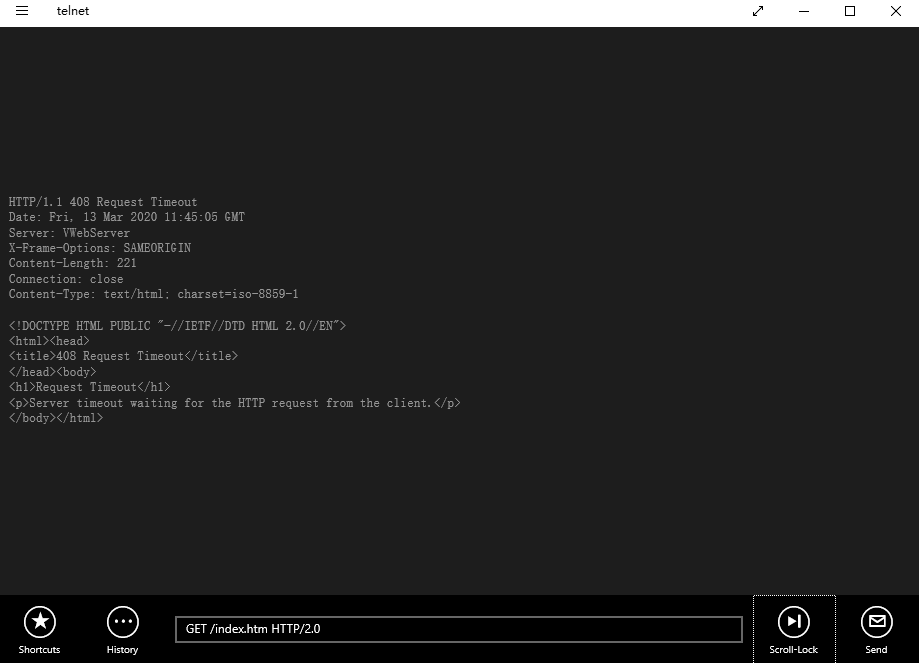
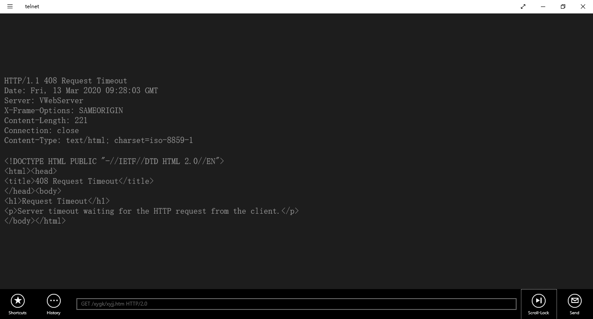

## telnet

1. 工具：Microsoft Store的telnet应用 本来应该使用cmd来做的，但因为电脑的Windows功能里没有找到telnet服务 按照网上的教程尝试修复系统组件也没有生效 Microsoft Store的telnet应用
2. telnet whu.edu.cn 25
   + 添加请求的主机信息
   + 连接——连接失败
3. telnet maths.whu.edu.cn 80
   + 添加连接主机信息
   + 连接并输入指令
     + GET /index.htm HTTP/2.0——请求超时
     + GET /xygk/xyjj.htm HTTP/2.0——请求超时

## 习题

### P4

1. a)gaia.cs.umass.edu/cs453/index.html
2. b)1.1
3. c)持续
4. d)报文中没有显示
5. e)Mozilla/5.0 用于识别不同的浏览器，以发送不同版本的网页

### P7

$$
2RTT_0+RTT_1+RTT2+.....+RTT_n
$$

