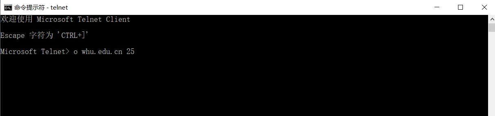
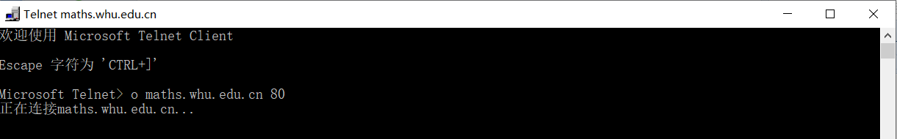

#第三次作业  

**P16•阅读POP3的RFC,即RFC 1939。UIDL POP3命令的目的是什么？**
	
解答：UIDL 即 unique-id listing，用于精确定位某个消息	
	
**P15:阅读用于SMTP的RFC 5321。MTA代表什么？  
考虑下面收到的垃圾邮件（从一份真实垃圾邮件修改得到）。  
假定这封垃圾邮件的唯一始作俑者是恶意的，而其他主机是诚实的，指出产生了这封垃圾 邮件的恶意主机。   
From - Fri Nov 07 13:41:30 2008 Return-Path: ennis5@pp33head.com> Received: from barmail.cs.umass.edu (barmail.cs.umass ・ edu [128.119.240.3]) by cs.umass.edu (8.13.1/8.12.6) for <hg@cs.umass ・edu>; Fri, 7 Nov 2008 13:27:10 -0500 Received: from asusus-4b96 (localhost [127.0.0.1]) by barmail.cs.umass.edu (Spam Firewall) for <hg@cs.umass ・ edu>; Fri, T '一 Nov 2008 13:27:07 -0500 (EST) Received: from asusus-4b96 ( [58•88.21•177]) by barmail・ cs<umass.edu for <hg@cs.umass•edu>; Fri, 07 Nov 2008 13:27：07 -0500 (EST) Received: from [58.88.21・177] by inbnd55 ・exchangeddd・ com; Satr 8 Nov 2008 01:27:07 +0700 From: "Jonny" <tennis5@pp33head.com> To: <hg@cs•umass•edu> Subject: How to secure your savings**  
解答：MTA(Mail Transfer Agents) 指参与邮件传输服务的 SMTP 服务器和客户端

根据received的性质,将消息转发到 Internet 环境或从 Internet 环境转发消息时，网关必须预先添加 Received 行，并且它不得以任何方式更改已在标题部分中的 Received 行。
因此排在最后面的 Received 行所指示的地址就是源地址，即58.88.21.177  

**telnet指令测试记录**  
  
在25端口 telnet whu.edu.cn  
  
尝试GET指令，失败，查阅资料后仍然失败，无法识别指令；而且还出现了小键盘输入“/”符号无法显示及识别的问题

在80端口 telnet maths.whu.edu.cn 无法连接到服务器
