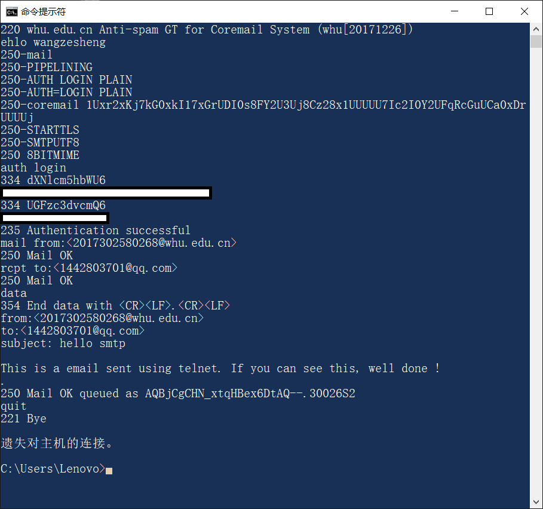
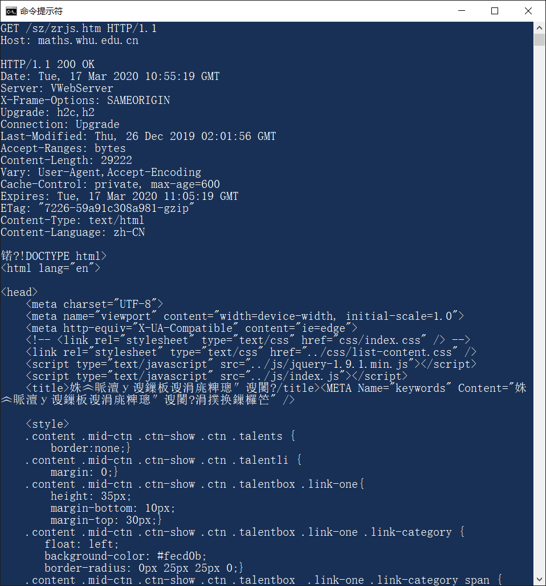

## Homework_2

**Author：**

姓名： 王泽生

学号：2017302580268

第二章题目选择：P8，P10


### 1 telnet whu.edu.cn 25

**操作描述：**

使用 `smtp( Simple Mail Transfer Protocol )` 协议手工发送邮件

**SMTP协议简介：**

SMTP协议：全称为 **Simple Mail Transfer Protocol**，**简单邮件传输协议**。它定义了邮件客户端软件和SMTP邮件服务器之间，以及两台SMTP邮件服务器之间的通信规则。SMTP协议的通信双方采用**一问一答的命令/响应形式**进行对话。

**操作步骤：**

1. 打开windows命令行

2. 输入`telnet whu.edu.cn 25` 回车

3. 连接成功，输入 `echo wangzesheng`

4. 选择登陆认证方式，输入`auth login`

5. 输入经过 `Base64` 加密的用户名及密码（使用在线加密工具）

6. 指定邮件发送方，输入 `mail from:<2017302580268@whu.edu.cn>`

7. 指定邮件接收方，输入 `rcpt to:<1442803701@qq.com>`

8. 输入 `data`

9. 输入邮件内容，格式如下

   ```
   from:<2017302580268@whu.edu.cn>
   to:<1442803701@qq.com>
   subject: hello smtp
   
   This is a email sent using telnet. If you can see this, well done !
   ```

10. 输入完毕，输入 `.`

11. 断开与邮件服务器的连接，输入 `quit`  

12. 检查接收方邮箱信息，查看邮件

**结果截图：**




### 2 telnet maths.whu.edu.cn 80

**操作描述：**

使用 telnet 工具发送 HTTP 请求

**操作步骤：**

1. 打开Windows命令行
2. 输入 `telnet maths.whu.edu.cn 80`  
3. 连接成功
4. 键入 `ctrl + [` ，以显示输入信息
5. 输入 HTTP 请求信息（如截图前两行所示）
6. 回车发送 Get 请求
7. 收到请求服务器返回信息
8. 查看武大数院官网页面返回信息（html）

**结果截图：**




### 3 课本第二章习题

#### P8

**题目：**

参照习题P7,假定在同一服务器上某HTML文件引用了 8个非常小的对象。忽略发送时间，在下列情况下需要多长时间： 

a. 没有并行 TCP 连接的非持续 HTTP

b. 配置有5个并行连接和非持续 HTTP

c. 持续 HTTP

**解答：**

**a. 没有并行 TCP 连接的非持续 HTTP**

每一个对象的请求都需要发起一次 TCP 连接，需要 2RTT0 的时间

总时间为：

RTT1+RTT2+···+RTTN+2RTT0+8*2RTT0

= 18RTT0+RTT1+···+RTTN

**b. 配置有5个并行连接和非持续 HTTP**

RTT1+RTT2+···+RTTN+2RTT0+2*2RTT0

= 6RTT0+RTT1+···+RTTN

**c. 持续 HTTP**

1. 流水线

   RTT1+RTT2+···+RTTN+2RTT0+RTT0

   = 3RTT0+RTT1+···+RTTN

2. 非流水线

   RTT1+RTT2+···+RTTN+2RTT0+8RTT0

   = 10RTT0+RTT1+···+RTTN

#### P10

**题目：**

考虑一条10米短链路，某发送方经过它能够以150bps速率双向传输。假定包含数据的分组是 100 000比特长，仅包含控制（如ACK或握手）的分组是200比特长。假定N个并行连接每个都获得1/N的链路带宽。现在考虑HTTP协议，并且假定每个下载对象是100Kb长，这些初始下载对象 包含10个来自相同发送方的引用对象。在这种情况下，经非持续HTTP的并行实例的并行下载有意义吗？现在考虑持续HTTP。你期待这比非持续的情况有很大增益吗？评价并解释你的答案。 

**解答：**

每一个下载对象能够被完全包含在一个数据包中。

我们使用 tp 表示客户端与服务器之间的单向传播时延。

**1 基于非持续HTTP的并行下载：**

并行下载允许10个连接分享带宽，每一个连接分得 15dps

（200/150+tp +200/150+tp +200/150+tp + 100000/150+tp) 

\+ （200/15+tp +200/15+tp +200/15+tp + 100000/15+tp) 

= 7737 + 8tp（seconds）

**2 基于持续HTTP的并行下载：**

（200/150+tp +200/150+tp +200/150+tp + 100000/150+tp) 

\+ 10*（200/150+tp + 100000/150+tp) 

= 7351 + 24tp（seconds）

由于链路长度短，tp对结果的影响可以忽略

综上所述，

HTTP比非持续的情况有很微小的增益。原因在于持续HTTP的增益在于减少发送控制分组的时间。但在此情况下 tp 的大小可以忽略，所以增益很微小。


