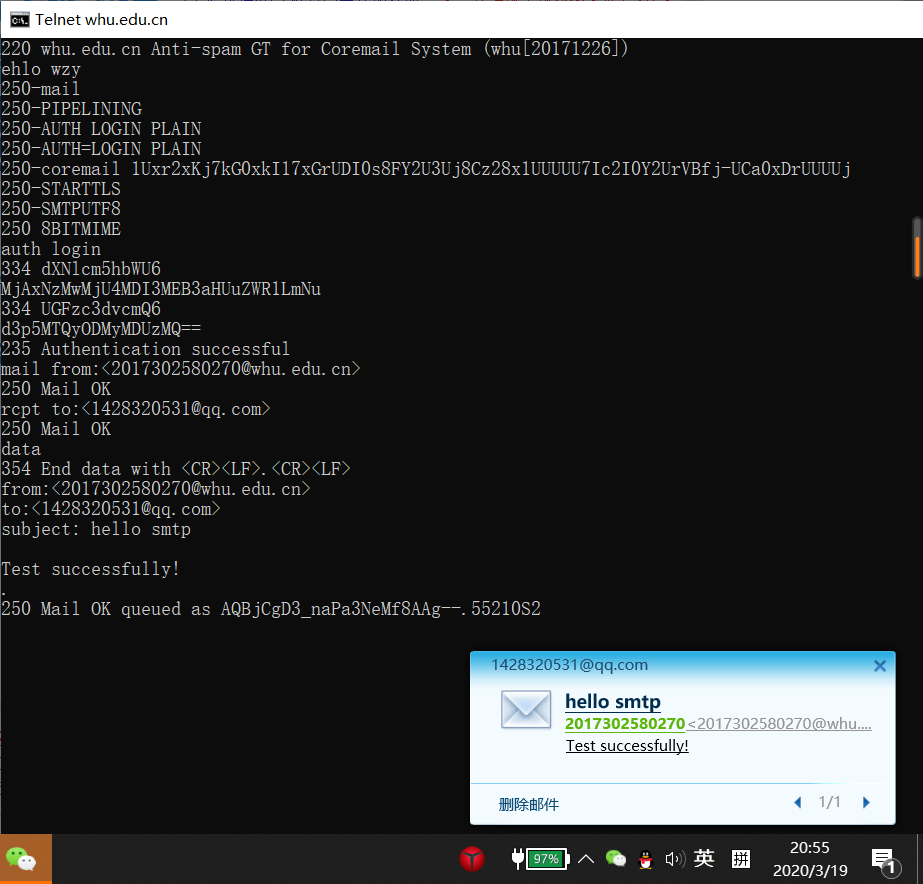
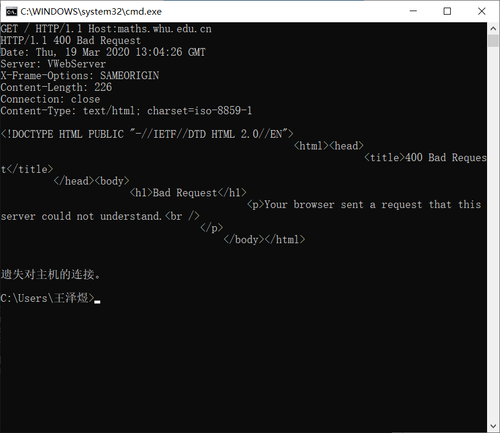

>网络及分布式计算第三次作业
====================================
2017302580270    王泽煜
------------------------------------
>>1.telnet whu.edu.cn 25
------------------------------------
在命令行输入：telnet whu.edu.cn 25
然后根据smtp协议与服务器进行交互，结果如下

>>2.telnet whu.edu.cn 80
------------------------------------
在命令行输入：telnet maths.whu.edu.cn 80
然后输入：
GET / HTTP/1.1
Host:maths.whu.edu.cn
接受到服务器端发来的信息，结果如下

>>3.俩道课本习题
------------------------------------
P9
题目：
考虑图2-12,其中有一个机构的网络和因特网相连。假定对象的平均长度为850000比特，从这个机 构网的浏览器到初始服务器的平均请求率是每秒16个请求。还假定从接入链路的因特网一侧的路由 器转发一个HTTP请求开始，到接收到其响应的平均时间是3秒（参见2.2.5节）。将总的平均响应 时间建模为平均接人时延（即从因特网路由器到机构路由器的时延）和平均因特网时延之和。对于 平均接入时延，使用$\Delta/（1-\Delta\beta）$，式中$\Delta$是跨越接入链路发送一个对象的平均时间，$\beta$是对象对该接入链路的平均到达率。
a. 求出总的平均响应时间。
b. 现在假定在这个机构LAN中安装了一个缓存器。假定命中率为0.4,求出总的响应时间。

解答：
a、$\Delta = \frac{850000b}{15Mbps} = 0.057s$
$\beta=16s^{-1}$
所以,平均接入时延$=\Delta/(1-\Delta\beta)=0.64s$
综上所述，平均响应时间 $=d+d_{http}=0.64s+3s=3.64s$
b、
$\beta^{'}=16*0.6s^{-1}=9.6s^{-1}$
此时平均接入时延=$\Delta/(1-\Delta\beta^{'})=0.13s$
还要考虑命中响应时间=$\frac{850000b}{100Mbps}=0.0085s$
综上所述平均响应时间=$0.4命中响应时间+0.6（平均接入时延+平均因特网时延）=0.40.0085s+0.6(0.13s+3s)=1.88s$

P10
题目：
考虑一条10米短链路，某发送方经过它能够以150bps速率双向传输。假定包含数据的分组是 100 000比特长，仅包含控制（如ACK或握手）的分组是200比特长。假定N个并行连接每个都获得1/N的链路带宽。现在考虑HTTP协议，并且假定每个下载对象是100Kb长，这些初始下载对象 包含10个来自相同发送方的引用对象。在这种情况下，经非持续HTTP的并行实例的并行下载有意义吗？现在考虑持续HTTP。你期待这比非持续的情况有很大增益吗？评价并解释你的答案。
解答：
每一个下载对象能够被完全包含在一个数据包中。
我们使用 tp 表示客户端与服务器之间的单向传播时延。
1 基于非持续HTTP的并行下载：
并行下载允许10个连接分享带宽，每一个连接分得 15dps
（200/150+tp +200/150+tp +200/150+tp + 100000/150+tp)
= （200/15+tp +200/15+tp +200/15+tp + 100000/15+tp)
= 7737 + 8tp（seconds）
2 基于持续HTTP的并行下载：
（200/150+tp +200/150+tp +200/150+tp + 100000/150+tp)
= 10*（200/150+tp + 100000/150+tp)
= 7351 + 24tp（seconds）
由于链路长度短，tp对结果的影响可以忽略
综上所述，
HTTP比非持续的情况有很微小的增益。原因在于持续HTTP的增益在于减少发送控制分组的时间。但在此情况下 tp 的大小可以忽略，所以增益很微小。

