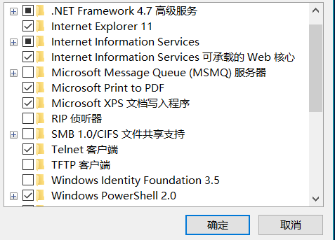
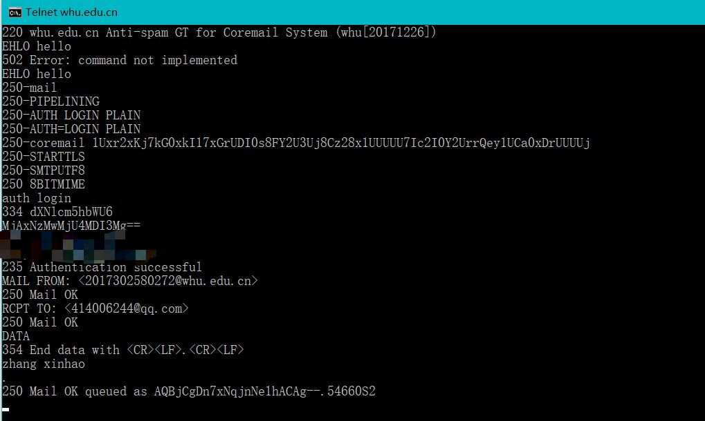
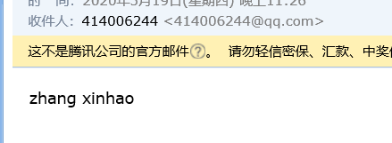

## 分布式计算与网络第三次作业

### 1. telnet whu.edu.cn 25
1.开启telnet服务  
<br/>
  
<br/>
2.输入telnet whu.edu.cn 25后进入telnet客户端  
<br/>
  
<br/>
3.收到邮件  
<br/>
  
<br/><br/>

### 2. telnet maths.whu.edu.cn 80
1.在命令行下输入telnet maths.whu.edu.cn 80
<br/><br/>
2.输入CTRL+]后回车可看到输入
<br/><br/>
3.输入GET https://maths.whu.edu.cn/ HTTP/1.1看到返回内容


### 3. 习题

#### p4
```
a.http://gaia.cs.umas.edu/cs453/index.html

b.http 1.1

c.持续连接

d.无主机IP地址

e.浏览器类型为Mozilla 5.0，不同的浏览器对网页渲染不同，适配不同，server可根据浏览器版本返回适应该浏览器版本的内容。

```
#### p9
```
设为平均接入时延为t1,平均因特网时延为t2
a.
Δ = 850000b/15Mbps = 0.0567s
β = 16次/s
t1 = Δ/(1-Δβ) = 0.61s
t = t1 + t2 = 3.61s

b.
β = 16次/s * 0.6
t1 = Δ/(1-Δβ) = 0.12s
命中响应时间t3 = 850000b/100Mbps = 0.0085s
t = 0.4 * 0.0085 + 0.6*(t1 + t2) = 1.8754s

```
