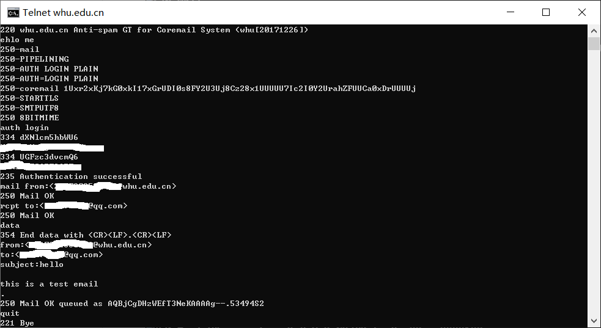
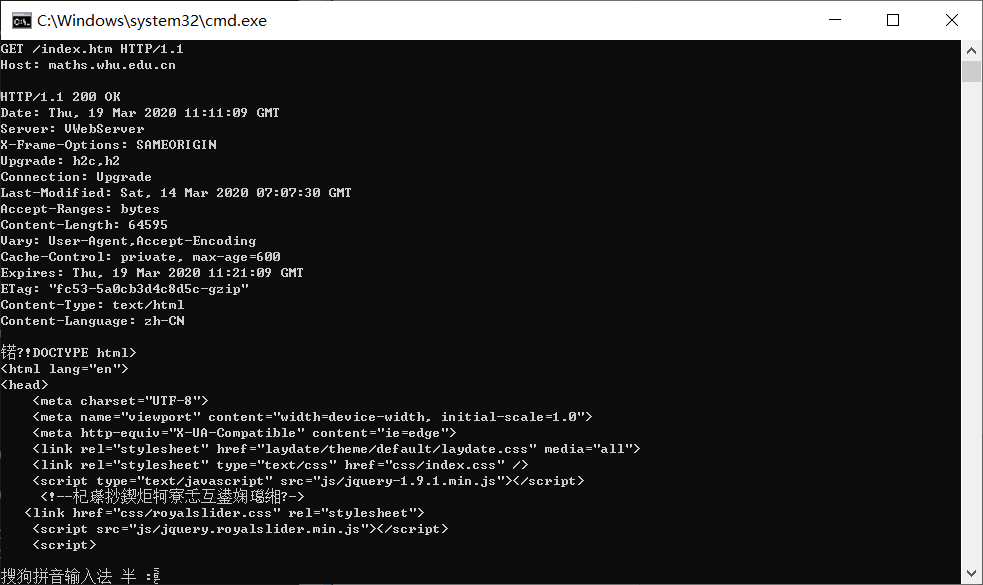

# telnet whu.edu.cn 25 #

----------

发送成功通知：

# telnet maths.whu.edu.cn 80 #

----------

# 习题7 #
假定你在浏览器中点击一条超链接获得Web页面。相关联的URL的IP地址没有缓存在本地主机上,因此必须使用DNS lookup以获得该IP地址。如果主机从DNS得到IP地址之前已经访问了n个DNS服务器;相继产生的RTT依次为RTT1、...、RTTn。进一步假定与链路相关的Web页面只包含一个对象，即由少量的HTML文本组成。令 RTT0表示本地主机和包含对象的服务器之间的RTT值。假定该对象传输时间为零，则从该客户点击该超链接到它接收到该对象需要多长时间?

----------
得到IP地址的时间 = RTT1 + RTT2 + … + RTTn；
三次握手加上最后的响应 = 2 RTT0；
因此总共是 2 RTT0 + RTT1 + RTT2 + … + RTTn
# 习题8 #
参照习题P7,假定在同一服务器上某HTML文件引用了8个非常小的对象。忽略发送时间，在下列情况下需要多长时间:

a.没有并行TCP连接的非持续HTTP。

b.配置有5个并行连接的非持续HTTP。

c.持续 HTTP。

----------
a.
2RTT0 + RTT1 + RTT2 + … + RTTn + 8 * 2 RTT0 = 18 RTT0 + RTT1 + RTT2 + … + RTTn

b.
2RTT0 + RTT1 + RTT2 + … + RTTn + 2 * 2 RTT0 = 6 RTT0 + RTT1 + RTT2 + … + RTTn

c.
2RTT0 + RTT1 + RTT2 + … + RTTn + RTT0 = 3 RTT0 + RTT1 + RTT2 + … + RTTn

