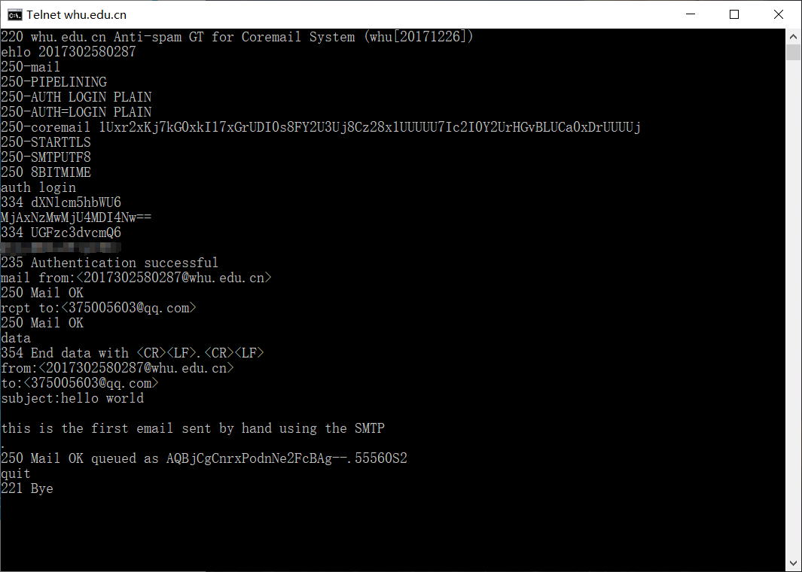
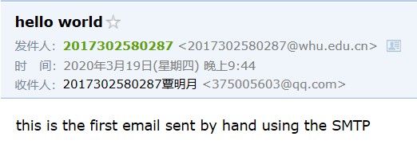
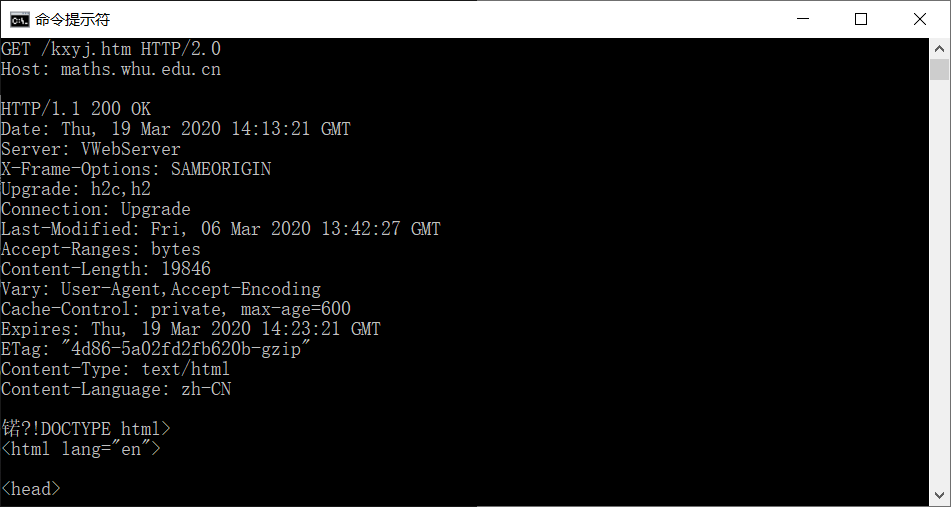
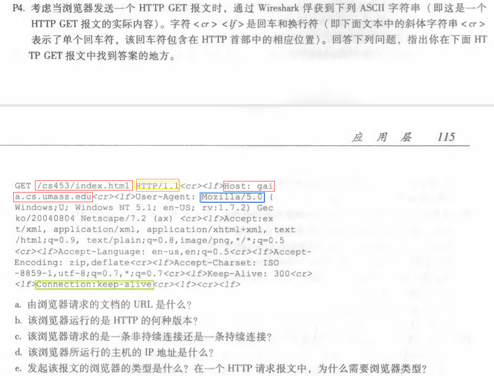
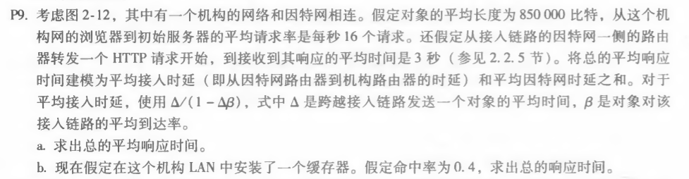

## 网络及分布式计算

### *第三次作业*

---------------------------------------------  
#### 一. telnet whu.edu.cn 25

##### 客户端查看  

#### 二. telnet maths.whu.edu.cn 80  
输入以上命令后，Ctrl+] 进入telnet客户端  

#### 三. 第二章课后题任选两题

#### 选择 P4、P9
####  P4

  

##### 答案：

a.    gaia.cs.umass.edu/cs453/index.html  ；见报文红框部分。  
b.    1.1   ; 见报文橙黄框部分。  
c.    持续链接   ; 见报文绿框部分。  
d.   报文中没有。  
e.   Mozilla/5.0 ；见报文蓝框部分  ；对不同类型浏览器发送不同版本的网页。  
####  P9  

##### 答案：  

