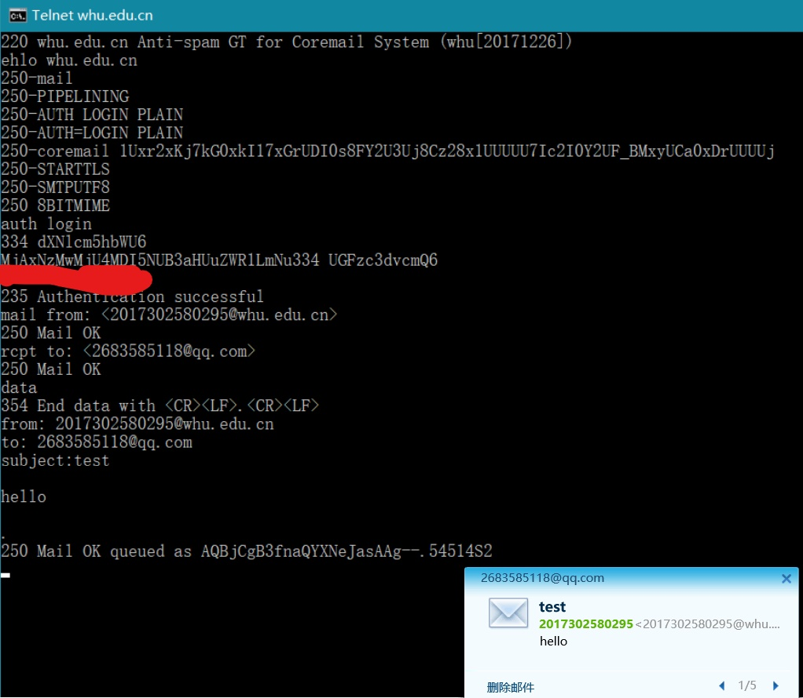
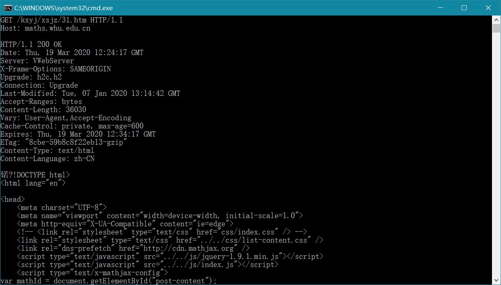

# 作业

## 2017302580295 刘晓林  

### telnet测试

#### 1.telnet whu.edu.cn 25 发送邮件  

#### 2.telnet maths.whu.edu.cn 80 发送邮件  

---

### 习题 P7

> 得到IP地址所需时间：T1 = RTT1 + RTT2 + … + RTTn ；
> 响应时间：T2 = 2 * RTT0 ；
> 总时间 T = T1 + T2 = 2 RTT0 + RTT1 + RTT2 + … + RTTn ；

### 习题 P10

> 由题目可知，短链路长度为10米，传播时延可忽略。
> 并行非持续：
> T1 = 3*(200b/150bps) + 100000b/150bps + 3*(200b/(150bps/10)) + 100000b/(150bps/10) = 7377.3 s  
> 持续：  
> T2 = 3*(200b/150bps) + 100000b/150bps + 10*(200b/150bps + 100000b/150bps) = 7350.7 s  
> 持续性HTTP与并行非持续性HTTP相比，相差二十多秒，但从总体用时来看，增益效果不是很明显。  
