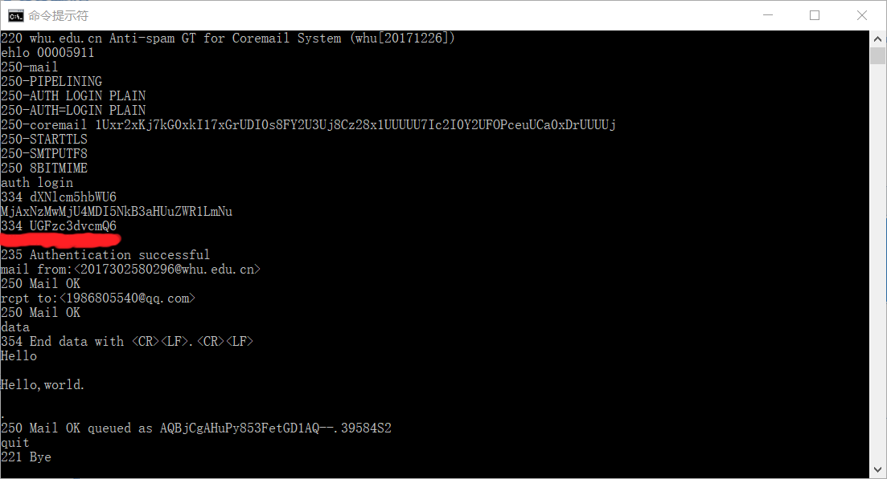
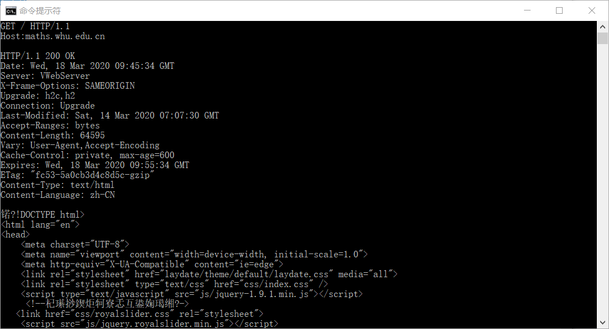

# 网络及分布式计算第三次作业
## 1、用Telnet实现邮件的发送
答：这部分主要难点在于使用Telnet实现发送邮件时登录用的用户名和密码是需要经过Base64编码的，在开始我并不知道这一点，因此出错好多次，在经过百度后就明白了。

在执行完操作后，就可以在邮箱收到使用Telnet发送的邮件了。

## 2、用Telnet体验Http协议
答：这部分我主要出现了使用GET / HTTP/1.1命令一回车就出现无效指令的问题，十分苦恼。后面也是百度了后才解决了问题，原来是要先按一下回车，会出来一个空白窗口，然后再输入GET / HTTP/1.1和后续命令。

## 3、课本第二章习题
### P1
答：a) F
### 
b) T
### 
c) F
### 
d) F
### 
e) F
### P9
答：a) 依据题意，跨越接入链路发送一个对象的平均时间为L/R，即850000(bits)/15000000(bits/s)=0.0567(s)。又因为从这个机构网的浏览器到初始服务器的平均请求率是每秒16个请求，所以链路上的通信强度为16(请求/秒)x0.0567(秒/请求)=0.907。因此，平均接入时延为0.0567/(1-0.907)=0.610(秒)。所以总的平均响应时间为3+0.610=3.610(秒)。
### 
b) 因为有40%的请求有机构的网络满足，所以访问链路的流量强度减少了40%。因此平均接入时延是:0.0567/(1-0.6x0.907)=0.124(秒)。如果请求由缓存器满足的话，其响应时间近似为0。当缓存器未命中时，平均响应时间为0.124+3=3.124(秒)。因此，总的响应时间为0.4x0+0.6x3.124=1.8744(秒)。